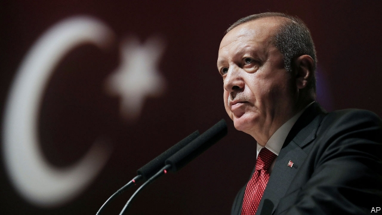

###### Another self-inflicted wound

# Recep Tayyip Erdogan sacks the head of Turkey’s central bank 

 

> print-edition iconPrint edition | Finance and economics | Jul 13th 2019 

TURKEY’S ECONOMY had just begun to show signs of recovery. High interest rates, a measure of calm following local elections earlier this year and attempts to rebuild a strained relationship with America had allowed the lira, which fell by 12% against the dollar in the first four months of the year, to strengthen. Inflation had fallen to 16%, from 25% last autumn. 

But in the small hours of July 6th Recep Tayyip Erdogan, Turkey’s president, put the progress in jeopardy by sacking Murat Cetinkaya, the boss of the central bank. Though Mr Cetinkaya was not widely admired by investors, his peremptory removal unsettled markets. Mr Erdogan compounded the damage by proclaiming that high lending rates were to blame for inflation (a view roundly mocked by economists) and making clear that it was he who was in charge of monetary policymaking. “We told him several times to cut interest rates at meetings on the economy,” said the president of Mr Cetinkaya. “We said that if rates fall, inflation will fall. He didn’t do what was necessary.” 

Mr Erdogan scored an own goal, says Paul McNamara, an investment director at GAM, an asset manager. “The best case is that they get a lira sell-off that keeps rates higher than they otherwise would have been. The worst case is that they set off a currency avalanche.” Mr Cetinkaya’s sacking showed that hopes of a respite in Turkish politics after the local elections were misplaced, says Wolfango Piccoli of Teneo, a risk-advisory firm. 

The lira plunged by over 3% against the dollar when trading began on July 8th, before recovering slightly. Turkey’s stockmarket index dropped by 1.5%. 

Mr Cetinkaya had reportedly been pressed by Mr Erdogan and his son-in-law, Berat Albayrak, the finance minister, to use the bank’s dollar reserves to support the lira ahead of the local elections. When Mr Erdogan and Mr Albayrak leaned on him to cut rates or resign, Mr Cetinkaya declined to do either—and was shown the door. He is the first central-bank boss to be sacked in Turkey since 1981, when an army junta dismissed most of the country’s political class after a coup. 

The new boss of the central bank is Murat Uysal, Mr Cetinkaya’s deputy—who is off to a terrible start. On July 8th he faced accusations of plagiarism in his Master’s thesis (as it happens, on inflation-targeting). He has not yet responded to the claims. Renewed pressure on the lira means he will struggle to cut rates at the next meeting of the monetary-policy board, on July 25th. Doing so could set off another rout, says Ibrahim Turhan, a former head of the Istanbul stock exchange. 

More bad news for the economy may be in store. America has threatened economic sanctions against Turkey regarding its purchase of Russia’s S-400 air-defence system. (Under a law passed in 2017, America can punish “significant transactions” with Russia’s defence sector.) Despite rumours of a compromise between Mr Erdogan and President Donald Trump, officials in Washington say sanctions are imminent. The Russian weapons were scheduled to arrive in Turkey as The Economist went to press. Mr Uysal faces a baptism of fire. 

