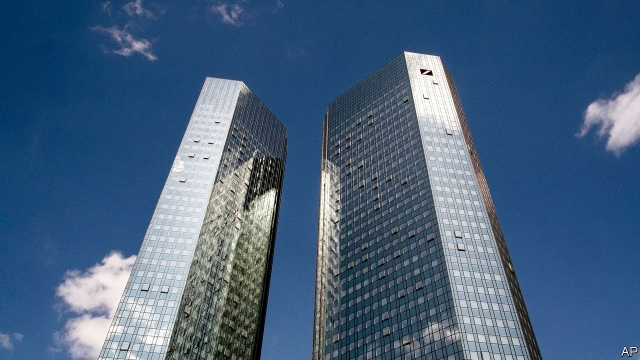

###### A threadbare lender’s new style

# Recognising reality at Deutsche Bank 

 

> print-edition iconPrint edition | Finance and economics | Jul 13th 2019 

“THE MOST fundamental transformation of Deutsche Bank in decades.” So Christian Sewing described his refashioning of the chronically unprofitable firm, announced on July 7th. Germany’s biggest lender is trimming its investment bank—and excising the trading of shares altogether. Mr Sewing, chief executive since April 2018, intends to cut costs by €5.8bn ($6.7bn) a year, a quarter of the total, by 2022. Eighteen thousand jobs, a fifth of the payroll, will go. Some equity traders were shown the door on July 8th. 

The restyling has taken five months to plan (during which time Deutsche also pondered and dismissed a merger with its Frankfurt neighbour, Commerzbank). It looks bold. Yet it is also a belated recognition of reality. For years after the financial crisis, Deutsche clung to the hope that it would again strut alongside Wall Street’s most glamorous names, as it had for a heady 20 years. Mr Sewing has binned the last threads of that ambition. The remodelled Deutsche—150 years old next year—will look a lot more like the sober servant of international companies it originally was. 

Mr Sewing is reshaping the bank around four lines. At the centre will be a corporate bank, chiefly providing European businesses with cash management, trade finance, foreign exchange and so forth: dull-sounding work but steady. A substantial investment bank remains, bringing in 30% of revenue, but geared to the needs of corporate clients, by arranging issues of securities and advising on mergers. The third element is Germany’s biggest retail bank, combining an eponymous posh brand and the dowdier Postbank, and the fourth is DWS, its biggest asset manager, of which Deutsche owns 80%. Mr Sewing is stuffing €74bn of risk-weighted assets he wants to discard into a “capital-release unit” (he balks at the term “bad bank” but may have to live with it). 

Restructuring will cost Deutsche €7.4bn, of which €5.1bn will land in 2019, entailing a fourth net loss in five years. Mr Sewing also plans to spend €13bn on sharper technology and €4bn on improving internal controls. Deutsche has been in legal hot water too often. According to the Wall Street Journal, America’s Justice Department is investigating whether Deutsche broke laws in its work for 1MDB, a Malaysian state development fund. Yet he intends to raise no new equity. By 2022 he expects Deutsche to be returning 8% on tangible equity and starting to pay shareholders a bounty of up to €5bn. 

The restructuring is a start in itself. The four core businesses notionally returned 1.7% last year and the bad bank, much of which Deutsche hopes to run off briskly, lost 6%. A more stable business model should mean lower funding costs. Still, an 8% return might be the bare minimum that shareholders expect. According to the European Banking Authority, a supervisor, four-fifths of European banks estimate their cost of equity to be above that mark. Even at a spruced-up Deutsche, costs will soak up 70% of revenues. That beats today’s 90%-plus, but the best banks do far better. 

The targets may also be hard to hit. Granted, Deutsche has met Mr Sewing’s cost-cutting goals so far; and he says his projection for revenue growth is “conservative”, just 2% a year. But European banking is far from lucrative. Interest rates are rock-bottom and growth is slow. Worse, in Germany an army of public-sector and co-operative banks tussle for the custom of savers and companies. Michael Rohr of Moody’s notes that Deutsche’s revenues have dropped since its last strategic revamp, in 2015. Quitting equity trading, he adds, makes Deutsche’s investment bank even more reliant on fixed income, where fee pools have been shrinking. 

Sensible as Mr Sewing’s plan looks, because Deutsche has fallen short so often investors will take some convincing. After it was unveiled, the share price fell to new lows, of just a fifth of net book value. “It is different this time,” Mr Sewing told journalists on July 8th. It has to be. 

