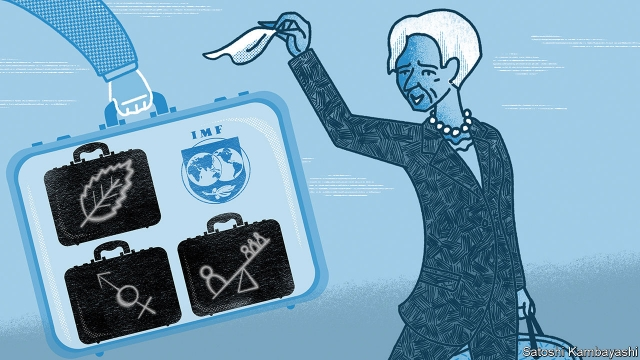

###### Changing of Lagarde

# The choice of the IMF’s next boss could be a coronation 

 

> print-edition iconPrint edition | Finance and economics | Jul 13th 2019 

FOR THE purposes of decision-making, the IMF’s 189 member countries are divided into 24 constituencies of peculiar shapes and sizes. Ghana, for example, belongs to the same group as Afghanistan. Ecuador sits with East Timor. But in choosing the next boss after Christine Lagarde moves to the European Central Bank in October, the most decisive constituency may be a different group entirely: the “New Hanseatic League”. This includes eight small, northern members of the European Union (EU) with bad weather and good credit ratings. They lost out in the fight for big EU jobs earlier this month. In compensation they may have a large say in Europe’s pick to lead the fund. 

That could be good news for Mark Carney, the charismatic and credentialled boss of the Bank of England. As well as Canadian and British citizenship, he holds a passport from Ireland, one of the new Hanseatics. If Ireland champions his cause in the league, and the league backs him within the union, he would be hard to resist within the fund. By convention the IMF is led by whichever European candidate the Americans can live with. And the Americans are unlikely to object to him, especially after the Europeans dutifully supported Washington’s choice to run the World Bank earlier this year. 

What about an Asian rival? One obvious candidate is Tharman Shanmugaratnam, a former finance minister and deputy prime minister of Singapore, who also chairs its monetary authority. As well as a background in economics, he has the virtue of hailing from a small country that is neither improvident nor imperious—the kind of country that would be a member of Asia’s Hanseatic league if it had one. 

But even in a fair race he would struggle to beat Mr Carney, who has run two of the world’s biggest central banks. And given the horse-trading between Europe and America, the IMF race will not be entirely fair. Why, then, bother entering? Candidates from outside Europe face a Catch-22: anyone credible enough to win an unrigged race will not be crazy enough to enter a rigged one. That is a pity, because a contest might force the fund’s members to think harder about the institution’s future. 

In 2004 Mr Shanmugaratnam revealed that he kept four canes in his cupboard, one for each of his children. But he never had to use them. That is many people’s ideal for how the IMF should work. Borrowing countries would live up to its standards of economic behaviour, fearing that otherwise it would refuse further lending. And speculators would be intimidated by the “flexible credit lines” and other tools in its cupboard, meaning that they would never test the currencies and creditworthiness those tools are designed to defend. 

In practice the fund rarely operates that way. It is reluctant to cut its members off, especially if they have powerful friends. This month, for example, it approved a $6bn loan to Pakistan, which has often flouted its prescriptions in the past. And even its biggest-ever loan, over $50bn approved for Argentina last year, was not enough to stop capital fleeing and the peso slumping in subsequent months. Rather than rely on the uncertain protection of the fund, many members have chosen to look after themselves, accumulating over $11trn-worth of reserves between them. 

Its next boss will find its cupboard a little bare. America is opposed to increasing members’ “quotas”: their permanent financial commitments to the fund (which now come to $660bn). Instead the IMF is trying to shore up alternative sources of financing, including $250bn it has borrowed for five years from 40 richer members. 

Limited firepower also threatens its legitimacy. A country’s financial contribution to the IMF determines its share of votes in the institution. So without an overall increase in quotas, the fund will struggle to redistribute voting power from over-represented countries in Europe to faster-growing members elsewhere. To do so would require cutting some members’ stakes in absolute terms, rather than merely freezing them as others expand. China, according to the IMF’S independent evaluation office, is now more under-represented than it was before the voting reform of 2008, because its share of global GDP has grown faster than its share of IMF votes. 

The fund’s response to this impasse has been innovative. Just as it has sought alternative sources of financing, it has also sought alternative wells of legitimacy. Ms Lagarde has energetically broadened its concerns to include inequality, gender and climate change. 

Critics worry that the IMF is now spreading itself too thinly, taking on new tasks when it has yet to master its customary responsibilities. It does not seem sure how to stop prices from rising in Argentina or those in Japan from threatening to fall. Should it wage an additional crusade against rising temperatures worldwide? But its new preoccupations may also help it meet some of its core duties. Its traditional advice to tighten belts, for example, carries more weight in many parts of the world because it has shown that it is sensitive to broader social ills. Good parents know that showing the cane is no substitute for showing that you care. 

