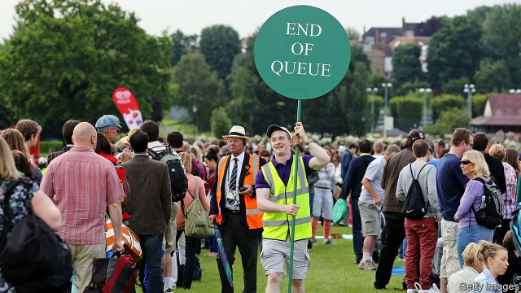

###### Ball-game theory

# To get a ticket to Wimbledon you must be rich, patient or lucky 

 

> print-edition iconPrint edition | Finance and economics | Jul 13th 2019 

ECONOMICS IS ALL about allocating scarce resources. Usually that is done by pricing. If demand for strawberries exceeds supply, prices will rise. Customers may switch to raspberries, or farmers may plant more strawberries. But some markets are more complex.  

Take those for tickets to popular events—like Wimbledon. The tournament is played over a fortnight each July at the All England Lawn Tennis & Croquet Club, which has a fixed capacity. Raising prices until demand met supply would exclude most tennis fans, tarnishing the tournament’s image. A price overshoot would leave some seats empty, ruining the atmosphere. 

Around a sixth of seats on Centre Court, where the big-draw matches are played, are reserved for debenture-holders, who pay through the nose for a specific seat for five years. These can be freely resold. Debentures for 2021-25 went for £80,000 ($100,000); a single resale ticket costs thousands. 

Other seats are rationed in different ways. The first is chance: the All England Club runs a ballot six months before the tournament each year. Winners get the option to buy a randomly allocated pair of tickets at a price that varies according to the day and court—this year, between £33 and £190. These cannot be resold. 

The second is queuing. Except on the final four days, 500 tickets for the top courts are sold every day to those first in line. And every day thousands more ground tickets are available for £8-25; these allow access to all other courts. The tickets of those leaving early are also resold for just £10-15. 

With so many rationing methods, fans must be tactical. Scoring a ticket to Centre Court generally means turning up a day in advance; a ground ticket merely requires getting up at the crack of dawn. 

Your correspondent favours a more relaxed approach. Avoid the first few days, when the top seeds dispatch their opponents in short order—and the last few, when there are fewer matches. In between are plenty of contests, many of them close-fought and therefore long. Maximise your tennis-watching and minimise your queuing by joining the resale line in the early afternoon—thereby enjoying the perfect match. 

