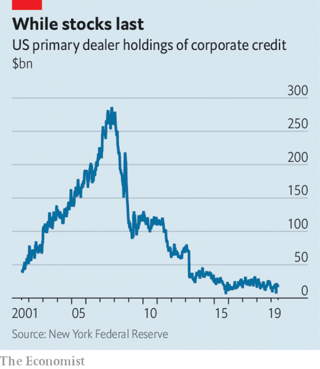

###### Buttonwood

# Why everybody is concerned about corporate-bond liquidity 

 

> print-edition iconPrint edition | Finance and economics | Jul 13th 2019 

IN SEPTEMBER 2007 Britain suffered its first bank run in a century. Television pictures showed a long queue of depositors outside a branch of Northern Rock. Alistair Darling watched in dismay from Portugal, where he and his fellow European Union finance ministers were gathered. “They’re behaving perfectly rationally, you know,” Mervyn King, the governor of the Bank of England, said in the smarty-pants manner that economists are cherished for. Mr Darling was uncharmed. “It was not what I wanted to hear,” he recalled. 

What Lord King probably had in mind was a well-thumbed textbook model. Banks have a liquidity mismatch. One side of the balance-sheet is hard-to-sell loans; the other side is deposits that can be withdrawn in a trice. If depositors believe that a bank is sound, there will be no runs on it. But if enough start to demand their deposits back, it makes sense for everybody to join the rush. 

This model can also be applied in other areas. Take the corporate-bond market. Every policy body of stature, from the IMF to the European Central Bank (ECB), has worried about a growing mismatch between investors’ expectations that they can sell out at any moment and an underlying shortage of liquidity in the market. More investors are using corporate-bond funds as an alternative to cash. But fewer dealers are willing to trade bonds in size. A big scare could feasibly start a run. 

The dynamics of capital-market runs are similar to those of bank runs. You see them in currency crises. Foreign-exchange reserves, say, are slim relative to the scale of local-currency assets held by flighty investors. Should enough of those investors sell out, others will soon follow. The result is a rout. There is a similar pattern with investment funds that promise speedy withdrawals but hold assets that cannot be sold quickly. Bad news prompts withdrawals. The speedy get paid. Other investors then try to get out, too. But the fund cannot sell assets fast enough. It is forced to suspend redemptions. 

Such trouble is especially likely with corporate bonds, which are inherently illiquid. In contrast with trading in shares, where buy and sell orders are matched on electronic order books, corporate bonds are traded over-the-counter. Bonds are not as standardised as shares. A company may have bonds of several different maturities. If you want to buy or sell, you call a dealer. 

The ease with which investors can trade bonds—the market’s liquidity—depends a lot, then, on the readiness of dealer banks to stockpile securities. Where there is heavy selling, dealers would ideally warehouse cheaper bonds for when people want to buy again. But since the financial crisis new rules have made it less cost-effective for banks to use capital for trading of any kind. The inventory of corporate bonds held by dealers has fallen sharply in the past decade (see chart). 

 

As the role of dealers has shrunk, the thirst for instant liquidity has increased. Derisory yields on the safest government debt have drawn investors towards riskier securities, including corporate bonds. A cheap and convenient way to invest in them is to buy an exchange-traded fund, or ETF. These are low-cost investment funds that hold a basket of bonds, usually mirroring a benchmark index. They trade on stock exchanges just as listed shares do. The ease of buying and selling bond ETFs is a big part of their appeal. They are also often used as depositories for spare cash. Studies are divided on whether ETFs make the underlying bonds more or less liquid. But there are concerns that in a stressed market, outflows from ETFs might make a bad situation worse. 

And it is not hard to make a case that the corporate-bond market has become more fragile. Many firms in America have issued lots of bonds to buy back their own shares. With extra leverage comes more risk. Half of all investment-grade bonds have a credit rating of BBB. In a recession a chunk of those bonds will be downgraded to junk. Many mutual funds and ETFs can hold only investment-grade bonds. If a lot of bonds have to change hands quickly, that could easily overwhelm the market’s limited liquidity. Prices might fall a long way. 

Just how messy the next big shake-out in the corporate-bond market is depends on many things: on how weak the economy gets; on how many BBB borrowers can avert a downgrade; on how quickly funds can be raised to buy at fire-sale prices. For now, it seems rational to hold bonds that afford a little extra yield. Smart-alecks say this will surely end badly. But who wants to hear that? 

