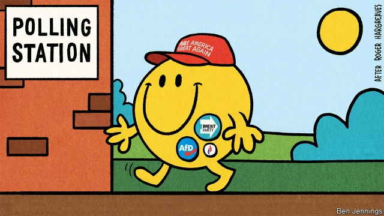

###### The satisfaction paradox

# Why are happy people voting for angry parties? 

 

> print-edition iconPrint edition | International | Jul 13th 2019 

“HAPPY?” SPLUTTERS a middle-aged man at a polling station in central London, when asked about his feelings on voting in a recent European election. “I’d be happy if I could kick all the bastards out.” 

He is not with the programme. In 1972 the king of Bhutan decided his country would adopt gross national happiness as a goal. At the time it seemed eccentric. But over the past decade, politicians in democracies have started to pay more attention to the idea that they should give priority to the well-being of their citizens. Thomas Jefferson argued that “the happiness of every individual [is] now acknowledged to be...the only legitimate object of government”. That view is now mainstream. 

In 2008 the French government set up the Stiglitz-Sen-Fitoussi commission to create new national accounts which go beyond GDP and reflect things like the quality of life and the state of the environment. Two years later Britain’s prime minister, David Cameron, set up a “well-being index” to measure Britain’s happiness and social progress. And this year New Zealand produced the world’s first “well-being budget” in which health and life satisfaction—not wealth or economic growth—would guide some public-spending choices. In practice, this has meant more money to combat child poverty, domestic abuse and mental health problems. 

Happiness matters not only in its own right but also because it influences whether politicians get elected. In 2017 a study by Federica Liberini of ETH Zurich, a university, showed that voters in Britain who said they were highly satisfied with their lives were 1.6% more likely to support the party in power. That may not sound like much, but she found that a 10% rise in family income was associated with a mere 0.18% increase in support for incumbents. In other words, well-being (or happiness) seems more important to the outcome of elections than money. 

A recent study by George Ward of the Massachusetts Institute of Technology confirmed the political significance of happiness. He looked at what best explains the variation in the incumbents’ share of the vote in 15 European elections between 1973 and 2014. Life satisfaction, he found, was twice as important in explaining how incumbents did as the unemployment rate and about 30% more important than GDP growth. Mr Ward also found that, in these 15 elections, almost half of those who were very satisfied with their lives said they would vote for the incumbent while less than a third of those who were not at all satisfied would. Research from America suggests that happiness has as big an effect on voting patterns there as education. 

All this suggests that happiness is the main determinant of whether a government gets re-elected, more important than jobs or wages. Make voters happier and you will get back in. Fail to do so and you will be booted out. But a question arises: how do you explain what is happening in Europe? 

In almost every European country, parties angry with the status quo have increased their share of the vote over the past decade or so. The populist right has got into power (usually in coalitions) in Italy, Poland, Hungary, Austria, Slovenia, Finland and Estonia. Britain voted to leave the European Union and, at recent elections to the European Parliament, the populist Brexit Party came from nowhere to top the polls. In France Marine Le Pen’s National Rally was the largest party and in Italy the Northern League doubled its share of the vote compared with the general election of 2018. It is true that some incumbents and centrists also did reasonably well. A centre-right party has just won in Greece and the centre-left topped the polls in Spain in April. But by and large the parties that long dominated European politics have been the biggest losers in elections. Voters seem miserable and want change. 

But when you look at indicators of happiness you find exactly the opposite message. Voters are satisfied. According to Eurobarometer, the European Union’s polling organisation, the proportion of Germans who consider themselves very or fairly satisfied with life has risen from 73% in 2003 to 93% in 2017, a substantial increase in a measure that in most of the world, most of the time, is fairly stable. In Britain the share went from 88% to 93%, and the share of those pronouncing themselves very satisfied soared from 31% to 45% in 2003-17, a remarkable change. In the EU as a whole, the share of those who say they are very or fairly satisfied rose from 77% in 1997 to 82% two decades later. 

These “life satisfaction” measures are backed by other indicators, which suggest the findings are of something real. The majority of Europeans, Eurobarometer finds, think their household finances are “rather good”. Most say they trust the army, the police, the courts, even television. Yet they are not voting as if they are satisfied. They are choosing populist, new or special-interest parties, not incumbents. Moreover, these parties are often getting a third of the vote—a higher share than the bit of the population which says it is dissatisfied (which is below 20% in most countries). Happy voters must be backing insurgents and populists. Why is the link between happiness and incumbency breaking? 

One possible answer is to say that support for both populism and happiness is going up because people are getting older. Old people might vote for more reactionary parties; they also tend to be happier. In Britain, according to YouGov, a polling organisation, 64% of voters over 65 voted to leave the EU, compared with only 29% of 18- to 24-year-olds. Measures of well-being leap up everywhere once you reach about 60. But even if Brexit reflects Britain’s carefree pensioners—and some evidence suggests that despite being older, Brexit voters were stroppier than average—there is little sign of such an age effect elsewhere. Support for other European populists—the National Rally, the League, AfD and so on—mostly decreases with age. These are parties of young and middle-aged workers, not cheery pensioners. 

A second possibility is that happiness is influencing politics but not the kind that is usually studied. Psychologists distinguish between two sorts: “evaluative” and “hedonic”. Evaluative measures answer the question: how do you evaluate your life at the moment? Hedonic ones answer the question: were you angry, or happy, or worried yesterday? Politicians tend to assume that evaluative happiness matters more in determining how people vote. But that might be wrong. 

The World Happiness Report finds that indicators of the average frequency of worry, sadness and anger on the previous day rose slightly in western Europe in 2010-18, even though general life satisfaction was increasing. Perhaps a decline in hedonic happiness lies behind the upsurge in support for populists, swamping the rise in evaluative happiness. 

Scraps of evidence support the idea that voters are indeed slaves to emotional whim, not people making rational judgments about which political party is most likely to contribute to their future happiness. Dr Liberini’s study discovered not only that happy people backed incumbents but that unhappy ones blamed governments for things that could not possibly be their fault. The death of a spouse, for example, reduced the likelihood of voting for an incumbent by 10%, compared with a control group. 

 

An American study from 2010 titled “Irrelevant events affect voters’ evaluation of government performance” came to a similar conclusion. College football and basketball games had a discernible effect on senate and governors’ races, pushing up votes for incumbents when local favourites won. Similarly, a study of 400 ballot propositions in Switzerland between 1958 and 2014 found that rain increases people’s risk aversion and rain on voting day reduced support for changing the status quo. Switzerland’s “deliberative democracy” seems not to feature much deliberation. 

Finally, it is possible that populists do well in countries with lots of happy people, even if happy people are less likely to vote for populists. This might be, suggests Cas Mudde of the University of Georgia, because such countries tend to be richer, and so economic concerns can take second place to social and cultural matters such as immigration, race and religion. 

If so, that would explain why support for extremists seemed to have increased (rather than fallen) as economies recovered from the 2008-09 financial crisis. A growing economy gives voters confidence to take a punt on parties which might seem irresponsible when unemployment is high or GDP is falling. Long ago, Seymour Martin Lipset, an American social scientist, pointed out that the high point of membership of the Ku Klux Klan was the gilded 1920s and McCarthyism blossomed in the prosperous 1950s. 

Matthijs Rooduijn of Utrecht University and Brian Burgoon of the University of Amsterdam looked at support for radical parties in 21 European countries from 2002 to 2014. They found that people who thought they were being left behind were less willing to vote for the radical right when the economy was weak (though support for the radical left was stronger). But when the economy recovered, support for the far right rose. Perhaps the most dangerous moment for an unpopular regime really is when things start to improve. 

One last factor to consider is less to do with voters than with politicians. This is that populists are using social media more adeptly than mainstream parties are. In the first three months of this year France’s National Rally and Germany’s AfD generated about 40% of all posts related to the European election campaign from political groups on Facebook in France and Germany. In Britain posts linking to the Brexit Party generated more shares than the posts for all other parties combined. In Italy’s general election in 2018, the League and the Five Star Movement dominated Facebook. Maybe the number of unhappy voters is not rising. Maybe it is just that thanks to the internet, populists are getting better at finding (or creating) them. 

None of this means that happiness has suddenly become irrelevant to the craft of politics. What it suggests is that the simple formula—politicians make voters happier, voters return them to power—needs refinement. The pursuit of happiness may be an inalienable right but the political rewards for increasing it are uncertain.  

