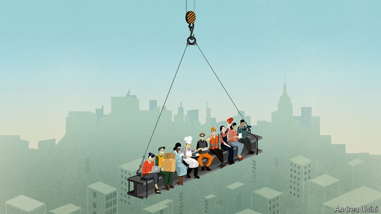

###### Riding high

# America’s expansion is now the longest on record 

 

> print-edition iconPrint edition | Leaders | Jul 11th 2019 

AROUND THE world investors, businesses and central bankers are grappling with a startling fact: at the end of July America’s economy will have been growing for 121 months, the longest run since records began in 1854, according to the NBER, a research body. History suggests there will be a recession soon. And plenty of people are gloomy. Bond markets have been sounding the alarm, as long-term interest rates sink below short-term ones, often a harbinger of a downturn. Manufacturing firms are wary; indices of business confidence are tumbling. Yet equity investors are still buoyant. The stockmarket is going gangbusters, rising by 19% so far this year. And in June America’s economy created a whopping 224,000 new jobs, more than twice as many as needed to keep up with the growth of the workforce. The result is a puzzle that matters a great deal. America’s economy accounts for a quarter of global output, so if it stumbles the world will, too. But if it proves able to extend the cycle a lot longer, it may be time to rewrite the rules for how all rich economies behave. 

The conflicting signals reflect an unusually sluggish and stretched expansion. Some of that is to be expected after the worst financial crisis in 80 years, but as our briefing explains, it is also owing to deeper changes in America’s $21trn economy. Growth is slow but more stable as activity has shifted to services and intangible assets. Thanks to new regulations and the recent memory of the bust, there are few signs of wild mortgage lending, over-investment or reckless financial firms. Inflation is remarkably subdued. These forces mean that a placid expansion can continue well beyond historical norms, but also suggest that the way it will eventually end will be different. Recessions used to be triggered by housing bubbles, price surges or industrial busts. Now you should worry about globally interconnected firms, a financial system addicted to cheap money and a political system that is toying with extreme policies because living standards are not rising fast enough. 

Average GDP growth during this expansion has been a mere 2.3%, much lower than the 3.6% that was seen in America’s three previous expansions. That reflects some deep malaises. The workforce is ageing. Big firms hoard profits and invest less. Productivity growth has been slow. Robert Gordon, an economist, worries that America’s genius for innovation is flagging. Emojis and bitcoins are no substitute for breakthroughs such as jet engines or the internet. 

That is the bad news. The good news is that the economy may be less volatile. A third of America’s 20th-century recessions were caused by industrial slumps or oil-price shocks, according to Goldman Sachs. Today manufacturing is just 11% of GDP and each dollar of output requires a quarter less energy than in 1999. Services have become even more vital, at 70% of output. Instead of fickle factories and Florida condos, investment has shifted to intellectual property, which now accounts for more than a quarter of the total. After the searing experience of 2008, the value of the housing stock is 143% of GDP, well below the peak of 188%. Banks are rammed full of capital. 

Most remarkable of all is very low inflation, which has averaged 1.6% over the course of the expansion. In many past downturns the jobs market overheated, causing inflation and leading the Federal Reserve to hit the brakes. Today the dynamics are different. The unemployment rate has fallen to 3.7%, close to the lowest in half a century, but wage growth is only a tepid 3%. Workers have less bargaining power in a globalised economy. The Fed’s credibility helps, too—most people believe that it can keep long-run inflation at about 2%. Given that racing prices are less of a worry and that it lacks the ammunition to deal with a serious downturn, the Fed is being more active at signalling that it will ease policy when growth dips. This week the Fed signalled it would soon nudge rates down from today’s 2.25-2.5%, to keep growth going. 

All this supports the idea that the familiar triggers for recession are still absent and that the moderately good times can roll on for years yet. The trouble with this logic is that, just as the economy has changed, so have the risks. Inevitably it is hard to identify exactly what might go wrong, but three new kinds of problems loom large. 

First, America’s glossy corporate champions have unfamiliar vulnerabilities. Although fewer make physical goods, most rely on global production chains that are being shaken by the trade war (see article). This is depressing investment and could yet produce a shock—imagine if Apple was cut off from its factories in China. Tech firms, meanwhile, now account for a third of all investment by listed firms, including intellectual property. Other businesses outsource their need for IT services to a few giants. One of them, Alphabet, spent $45bn in the past year, five times more than Ford. But 85% of its sales come from advertising, which has been cyclical in the past. It and other tech firms also face a regulatory storm. 

The second risk is financial. Although house prices and the banks have been tamed, total private debts remain high by historical standards, at 250% of GDP. An edifice of asset prices and borrowing rests on the assumption of permanently low and stable interest rates, making it more fragile than it looks. If rates rise there will be distress among some firms, and trouble in debt markets—there was a sell-off in late 2018. If, by contrast, the Fed has to cut rates to near zero for a prolonged period to sustain growth, it could weaken the banks, as Europe has found. 

The last danger is politics. As the economy has trodden a narrow path, the boundaries of economic policy have been blown wide apart, partly out of frustration at a decade of sluggish wages. President Donald Trump has tried to gin up growth, by cutting taxes and attacking the Fed. Most Democrats are keen to let rip on government spending. More extreme policies hover in the wings. On the left, modern monetary theory (a kind of money printing) and massive state intervention are popular. One of Mr Trump’s new nominees to the Fed board supports a gold standard. The greatest threat to America’s long and placid expansion is that a new era of wild policy may be just beginning. 

