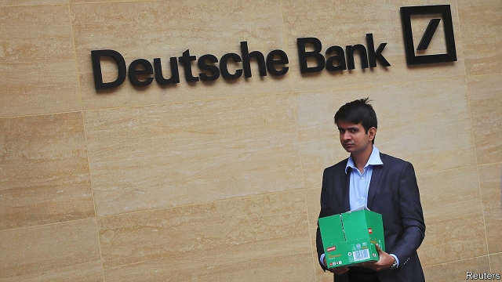

###### Europe’s nightmare on Wall Street

# Deutsche Bank’s retreat ends European hopes of conquering Wall Street 

 

> print-edition iconPrint edition | Leaders | Jul 13th 2019 

IN THE 1980S the first of what was to become a procession of European banks began an assault on Wall Street. Credit Suisse bought First Boston in 1988. Deutsche Bank swallowed Bankers Trust a decade later. After the turn of the century, UBS, RBS, Barclays and others also waved their chequebooks. The motive was partly to follow customers as business globalised, but also defensive: a response to American rivals’ charge into Europe. 

This week Europe’s dream of going toe to toe with homegrown investment banks in the world’s deepest capital market came to a shuddering end with the capitulation of Deutsche Bank. Its overdue restructuring will involve 18,000 job losses, mostly in London and New York. The retreat is a humiliation for a bank that once signalled a desire to knock Goldman Sachs off the top of global investment-banking league tables. Before the financial crisis Deutsche was the biggest-spending and brashest of bulge-bracket firms. In 2007 it was in second place, snapping at Goldman’s heels. Now it languishes outside the top five—and it may have farther to fall. 

Today the Europeans are shadows of their former selves. Some have given up on Wall Street to focus instead on consumer and corporate banking at home (RBS) or on wealth management (UBS and Credit Suisse). The top five global investment banks—led by JPMorgan Chase—are all American. In 2007 the Americans’ share of industry revenue was 46%, against 39% for their European rivals; in 2018 it was 52% versus 26%, according to Dealogic. The American banks’ average return on equity is 13%, double the Europeans’. 

How were they able to pull so far ahead? The answer lies in a series of missteps by European banks and circumstances beyond their control. Start with the banks’ faults. The financial crisis exposed a vulnerability: European banks with big dollar-funding needs required large liquidity injections from the Federal Reserve. But the banks had misfired long before. They underestimated the cultural challenges of integrating firms steeped in their own lore and stuffed full of prima donnas. They touted injudiciously for business as they scrambled to catch up with the Americans—hence, for instance, Deutsche’s willingness to lend to Donald Trump long after American banks began to steer clear. Controls were loosened to help the expansion along. It is no coincidence that the worst mortgage-related blowups and money-laundering and sanctions lapses were at European banks. When trouble hit, many were lamentably slow to flush out bad assets and build up their equity. Some stubbornly refused to restructure, even as headwinds howled. 

But the Europeans would have been hamstrung even if they had avoided such mistakes. Their ambitions are built on a less solid foundation: American banks enjoy a giant, homogeneous home market, whereas Europe’s remains fragmented. America’s economy has grown faster than anaemic Europe. Regulatory fragmentation has taken a toll, too. American firms were forced to face up to their problems quickly, in 2008, taking government money and recognising losses under the TARP programme. With no central authority willing or able to impose it, competitors across the pond received no such tough love. Slow to react to the crash of 2008, European policymakers have since been slow to agree on financial fixes. 

America’s trouncing of Europe in securities sales, trading and dealmaking has a clear benefit: greater efficiency. Wall Street’s homegrown giants are leaner, better managed and able to spend more on technology. But a reduction in competition is to be lamented, especially since advisory and underwriting fees remain fat. The most likely source of competition in the long term is China. Its big banks have zoomed up the league tables in Asia, and their ambitions stretch far beyond the region. Still, managing giant egos and pay packets is not easy. This year CITIC Securities, the biggest mainland firm, has faced an exodus of top staff from its international arm. In the meantime, the Americans can savour their defeat of the European upstarts. 

Yet victory has a sting in the tail. The share prices of most of the big American banks have lagged the stockmarket since 2008—none too impressive for masters of the universe. It is worth remembering that, even as thousands of Deutsche bankers are shown the door, the big winners of the past quarter-century have been the industry’s employees, not its shareholders. 

