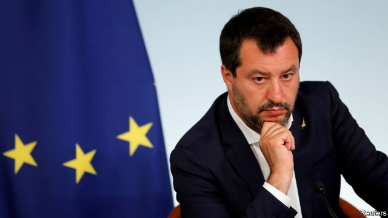

###### The most dangerous man in Europe

# How to defuse the threat that Matteo Salvini poses to the euro 

 

> print-edition iconPrint edition | Leaders | Jul 13th 2019 

ON JULY 8TH euro-zone watchers breathed a sigh of relief. The zone’s 19 finance ministers backed the European Commission’s decision that Italy should not be penalised for allowing its public-debt burden to rise in 2018 in violation of the EU’s fiscal rules. Thanks to savings of 0.4% of GDP for the current year, cobbled together by Italy’s governing coalition, a damaging confrontation seems to have been resolved. 

In truth, however, it has merely been postponed. The grim reality of Italy’s public finances remains unchanged. Its deficit is on course to exceed the EU’s threshold of 3% of GDP in 2020, its debt is sky high and, worst of all, it is plagued by a persistent absence of growth. If Italy is to dispel the ever-present air of crisis, a much more far-sighted deal will be needed. 

Since the euro was introduced, over 20 years ago, Italy has steadily fallen behind the rest of Europe. The average citizen in Germany, France and Spain is a fifth better off, in real terms, than in 1999; incomes in eastern Europe have more than doubled. But the average Italian is no richer. 

Dissatisfaction at this record has been skilfully converted into votes by Italy’s government, an unwieldy coalition between the Northern League and the Five Star Movement. The League’s leader, Matteo Salvini, has been able to whip up anger against two main enemies: the EU, which he says is a “gulag” that imposes wretchedness, and the inflow of migrants from Libya, which he also blames in part on the EU. Six years ago the League managed only 4% at the ballot box; today it is the country’s most popular party. Thus Mr Salvini has used the politics of grievance to make himself the most powerful man in Italy (see article). He is not yet prime minister, but he surely intends to be. 

This is a recipe for continual confrontation with Brussels. And that, in turn, is the EU’s most alarming problem. Italy’s public debt is a colossal €2.3trn ($2.6trn), or 132% of GDP. The country is too big to bail out. Its failure to grow makes its finances—and the banks exposed to them—fragile. A row over its budget last year unsettled markets before the coalition made hasty concessions. The latest uneasy truce is unlikely to last. 

The Italian coalition says the EU’s fiscal rules choke off demand-led growth. Mr Salvini has promised huge tax cuts. Luigi Di Maio, his coalition partner, wants more welfare. Brussels says the problem is structural; anyhow, it has already granted Italy over €30bn of extra fiscal space since 2015, nearly 2% of annual GDP. This vexes northerners, who want the rules enforced. 

Neither side is entirely in the right. Italy’s economy, hit by slowing global trade, is unlikely to be as near its potential as the commission reckons. But the coalition’s attempt at stimulus last year backfired when markets took fright. Though interest rates have since come down, Italy’s borrowing costs, once near those of Spain, are now within spitting distance of Greek yields, which have fallen with the prospect of a new centre-right government. 

Many of the reasons for Italy’s bleak growth prospects date back decades. Courts operate at a glacial pace; bureaucracy is labyrinthine. The services sector is sheltered from competition. Countrywide pay agreements keep wages too high in the south, discouraging formal employment there. Far from tackling these ingrained problems, the government has ignored them and instead undone unpopular but necessary reforms to the pensions system. In light of all this, last-minute concessions to the EU’s fiscal rules solve nothing. Confrontation is merely deferred until the next time the commission reviews Italy’s books. The threat of an accidental bond crisis never fully recedes. 

Instead of haggling over tenths of a percentage point, the commission should enter negotiations over next year’s budget aiming for a more ambitious agreement. It should be flexible over public spending, on the condition that Italy enacts growth-enhancing reforms. Those reforms are more likely to work if their implementation is supported by fiscal easing. The public-debt ratio would then fall more quickly. 

Such a deal offers something to both sides. Italy’s populists may ignore reprimands from Eurocrats, but they do worry about the markets. If they were to accept some curbs on their spending, they would regain some of their credibility with investors, and bank the electoral benefits of higher economic growth to boot. For Brussels, a deal along these lines would defuse the long-term threat that Italy poses to European financial stability. Eurocrats should remember that, as Italy falls further behind, the resentment that has fuelled Mr Salvini’s alarming rise will only grow. 

