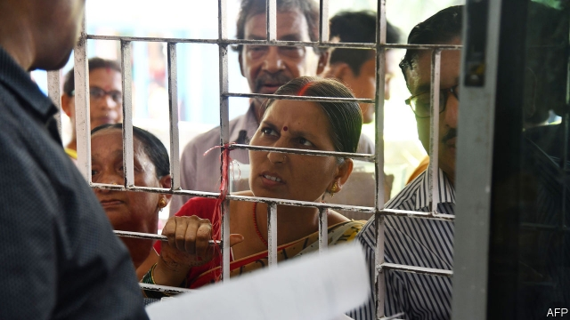
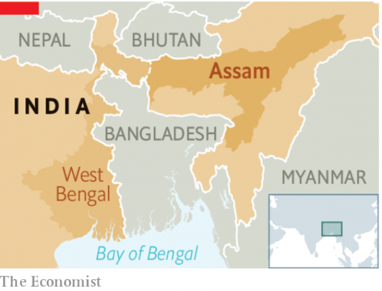

###### Show me your papers

# India’s hunt for “illegal immigrants” is aimed at Muslims 

 

> print-edition iconPrint edition | Leaders | Jul 13th 2019 

AMIT SHAH, India’s home minister, calls them “termites” and “infiltrators”. The government will hunt them down and throw them into the sea, he thunders. Unfortunately, it is not just the standard bluster from a nativist politician railing against illegal immigration. Last year bureaucrats in the Indian state of Assam, which has a population of about 33m people, produced a list of more than 4m of its residents whom they consider foreigners, without any right to live there. A further 100,000 people were deemed non-citizens in June (see article). 

Mr Shah insists that all these people will be deported. In practice, neighbouring Bangladesh, from which they are said to have migrated, will not accept them, since in most cases there is no evidence that they are anything other than Indians too poor and uneducated to navigate the complex bureaucracy of citizenship. But even if the threatened mass deportations never take place, the process of declaring people aliens, and hauling lots of them off to internment camps, is not only a rank injustice, but also a threat to stability. The supposed illegal immigrants are overwhelmingly Muslim. The purge is therefore exacerbating sectarian tension in a state that saw bloody Hindu-Muslim riots as recently as 2012, when some 400,000 people were displaced. Yet Mr Shah considers the campaign in Assam against illegal immigrants such a success that he wants to replicate it throughout the entire country. 

Indigenous Assamese have long complained that they are being swamped in their own homeland by migrants from Bengal, the densely populated region to the south (see article). In colonial times, there was such an influx, since there were no borders to stop poor Bengalis moving north in search of a better life. Assamese nationalists, pointing to Bengalis’ ever higher share of the state’s population, insist the flow of migrants continues to this day, even though the Muslim part of Bengal has become a separate country, Bangladesh. 

 

Muslims make up a third of Assam’s population. The state’s shifting demography is mainly the result of a higher birth rate among Bengalis already in Assam, not migration. But that has not stopped the Bharatiya Janata Party (BJP), which dominates both the state and national governments, from vowing to collar lots of illegal immigrants. And since so few of them exist, more had to be invented. 

The law the government is eagerly enforcing requires all residents to prove that they or their forebears were in the state by March 24th 1971. That is a big hurdle for poor farmers and itinerant workers, especially women, many of them illiterate. Suspects can be denounced as non-citizens by anonymous tips, an invitation to abuse. There have been lots of mistakes, such as a decorated war hero who was declared not to be Indian. Roughly 60% of those found not to be citizens at the 100 “foreigners’ tribunals” the state government is setting up were not even present for the proceedings. Some 3.7m of the 4m people declared illegal immigrants are challenging their designation. There has been a spate of suicides tied to adverse rulings. 

Worse, like so many of the BJP’s schemes, the hunt for illegal immigrants is openly anti-Muslim. Some Hindus have been caught in the dragnet, but Mr Shah says they do not need to worry, since the government has drafted a bill to make it easy for Hindu refugees to claim citizenship. Christian, Buddhist, Jain, Parsi and Sikh refugees can too—just not Muslims. 

Anything that polarises voters by religion benefits the BJP, especially in nearby West Bengal, where Muslims are over a quarter of the population and the BJP is locked in a political knife-fight with a regional party it accuses of coddling Muslims, the Trinamool Congress. West Bengal is one of the places where Mr Shah has railed against termites. But it is not phantom foreigners, rather the BJP, through its stirring of sectarian tensions, that is gnawing away at the foundations of Indian democracy. 

