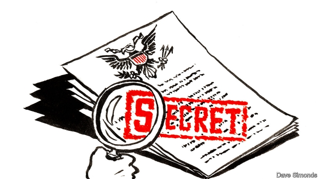

###### Top Secret!

# The Economist has seen leaks from the US ambassador in London 

 

> print-edition iconPrint edition | Leaders | Jul 11th 2019 

M ONDAY: Today Theresa May came over. Said she wanted a trade deal to cement her legacy before she quits as prime minister in a couple of weeks. I told her Britain would need to accept our food standards, and gave her chlorinated chicken to show her how delicious our traditional American chow is. I think she liked it, and she has nice manners: when she clears her throat, she lifts her napkin up to her mouth and coughs straight into it. She seemed sad so I gave her a couple glasses of bourbon, which may have been a mistake: she put on “I will survive” and started dancing with one of the security guys before collapsing into a tearful heap. Mrs Johnson put her to bed in a spare room. 

Tuesday: Today Boris Johnson came over. Remember him? The guy with weird blond hair who makes no sense…never mind. Seems he’s taking over from Theresa. You don’t have to get elected by the people to be in charge here, just by the Conservative Party. That’s 160,000 old right-wing men. Interesting system. You might want to look into it. 

I told Johnson that I was struggling to get my head around his position on whether Britain was going to leave the European Union with or without a deal. He muttered something about “having your cake and eating it”, so I ordered tea and crumpets, as the State Department’s British etiquette handbook recommends. He polished them off, saying he hadn’t had a square meal in weeks, and asked if I had a spare room. Apparently he’s had woman trouble, so I’ve put him up for a few days. I figured you’d sympathise. 

Wednesday: Today Mark Carney, the Canadian guy at the Bank of England, came over. I didn’t follow every nuance of his analysis of the economic consequences of a no-deal Brexit, but it involved four horsemen and a substantial number of plagues. He is a great fan of yours, sir, and said something about ensuring the current expansion was not brought to an overhasty close by injudicious monetary tightening. He also mentioned that he’s looking to move to a new job in Washington and wondered if you might be ready to put in a good word. I ordered some tea and crumpets, but he didn’t touch them. I guess he’s too small to carry any extra weight. He’s kind of hanging around looking hopeful, so I’ve put him in the waiting room where I keep old copies of The Economist that nobody has read. 

Thursday: Today Jeremy Corbyn came over. He’s the communist with the beard who vacations in Venezuela. The political counsellor tells me that he’s probably going to be PM soon, after the blond one goes down in flames. Nobody likes him, and his party got only 14% in the recent elections, but I guess that doesn’t matter here. I ordered tea and crumpets but he said he would prefer carrot juice. 

He lectured me about Labour’s position on the terms of a trade deal after Brexit. Sir, I know you said that health-service provision should be “on the table” in a deal, but if Corbyn’s state is anything to go by, I don’t think we should touch it. In the middle of a speech about how the workers, united, would never let America take over their National Health Service, he suddenly collapsed on the carpet, clutching at his heart. Turns out there were rumours about his health, so he went and did a photo-shoot working out in a park with Rihanna’s trainer, and it’s been a bit much for him. I called a (private) doctor and put him in another spare room. 

Friday: Today the queen came over. I asked the staff to bring tea and crumpets, but she gave the crumpets to the corgis, waved away the tea and ordered herself a supersized gin and tonic. We’ll need to get the etiquette handbook updated. She put her feet up on the couch and said that, because of our special relationship, she felt she could confide in me: the country was going to the dogs, the Scots would get their independence, Northern Ireland would end up joining the folks in the South and even the Welsh were restless. She didn’t think there was any point in being monarch of Britain if it wasn’t Great any more. 

She was kind of wondering whether we could put aside that difficult episode in 1776, and thought that she might get a gig with us. I said it could be tricky, what with her being British and all, but she’s a very determined woman. She tried the line that she had a half-American great-grandson, and then said she’s got a great place in Scotland you could have. It has room for lots of golf courses and she’d make you a Thane. Now she seems to have dozed off. The etiquette book doesn’t say what to do with monarchs who are snoring on your couch. Could you ask Ivanka? She’s good with awkward social situations. 

