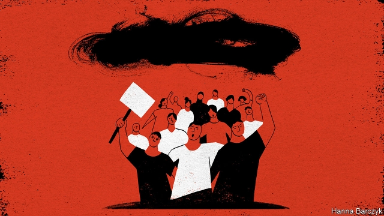
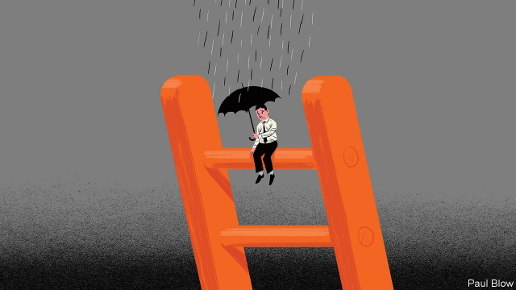

###### On banks, GPs, othering, Hong Kong, the promotion curse, Greenland, sausages

# Letters to the editor 

> Jul 13th 2019 

 

You suggest that Facebook’s “Libra Reserve” cannot be a bank, because it holds deposits in private banks and will not have access to central-bank money (“Libralised finance”, June 22nd). If so, Walter Bagehot would have disagreed. 

During his editorship of your newspaper, hundreds of country banks in England held no accounts at the Bank of England. Instead, they held deposits, in the form of so-called “nostro accounts”, inthe privately held City of London clearing banks. 

Only the latter had access to central-bank money through their reserve accounts at the Bank of England. 

ANTTI JOKINENKongsvinger, Norway 

 

“What’s up, doc” (June 29th) detailed a number of world-class general-practice reforms that could help the NHS to meet the rising health-care demand. Employing additional team members, merging back-room operations and working more proactively to prevent illness in local communities are vital means of improving efficiency. However, your article failed to mention a serious counter-intuitive downside to all this sharing—the issue of fragmentation. 

Whereas other medical specialties are defined by body parts and diseases, family medicine is concerned with managing the problems of real-life people in glorious psychological, cultural, and social technicolour. We are also set apart by the life-long relationships we build with our patients. 

Long-term relationships are highly valued by doctors and patients alike, and have been found to improve health outcomes. Sadly, these relationships are being irrevocably eroded by demographic, economic, and epidemiological forces. 

Increased team working is often fantastic, but we need to acknowledge that it expedites the transition to a reductionist medical model where GPs only get to see complicated biomedical problems; sacrificing rich, holistic, long-term relationships on the altar of efficiency. 

DR LUKE ALLEN GP Academic Clinical FellowUniversity of Oxford 

 

Banyan typifies what social commentary has devolved to in the social-media age (“Them v everyone”, June 29th). By hastily indicting groups of “others” as othering, you perpetuate the very phenomenon that you seek to condemn. Sri Lanka is intolerant and India is “addicted” to its habit of othering others. South Asians possess an affinity to divide by religion or caste and this article has inadvertently peddled its own stereotypes. 

I have no gripe with the substance of the article: I join The Economist in lamenting the cocktail of violence and prejudice percolating through South Asia. Still, Banyan avoids a discussion of the social conditions that trigger religious or ethnic insecurity. Surely there are some forces at play that are not just endemic to this area. Just look at the vigour of “us versus them” politics in Donald Trump’s America. 

ABIR VARMANew York 

 

The protests in Hong Kong against the bill that would allow extraditions to mainland China are mounting challenges to the authority of Xi Jinping as China’s leader (Chaguan, June 29th). 

Frustrated activists have adopted extreme protest tactics including storming the Legislative Council of Hong Kong and the police headquarters. Protesters also worked with Hong Kongers overseas to call for international pressure on the government. 

Mr Xi and protesters are both unlikely to make concessions. Given more repression and confrontation Hong Kong will be in the global spotlight as a major battleground of freedom and democracy. It will be a litmus test of how China upholds its promises and respect for human rights that the international community should closely monitor. 

ALEX YEUNGVancouver, Canada 

 

I couldn’t agree more with Bartleby’s perspective on the promotion curse (June 22nd); it is a particularly pernicious issue in the world of management consultancy. My colleagues and I all worked for many years in the traditional environment of big consulting firms and saw first-hand how counter-productive the laddering promotions structure within these firms is. 

Promotions are often based on consultants’ ability to sell more work rather than their consulting skills and the internal admin involved in performance management, especially when working towards a promotion, is so arduous that it can take up to 40% of a consultant’s time. 

For this very reason we offer our consultants no promotions, sales targets or bonuses. Removing the distraction of promotion and all the politics and competition that comes with it has allowed our consultants to focus on doing the best job they can for the client, while developing the skills that actually attracted them to the profession in the first place. 

HADLEY BALDWINPartnerThe Berkeley PartnershipLondon 

Bartleby’s update of the Peter principle should be read by all. Not many of us have the ability to become presidents, prime ministers and captains of industry and neither should we wish to. 

It is far better for both the organisations for which we work and ourselves if we can enjoy what we do and work on tasks at which we are good in return for sufficient remuneration to lead a comfortable life rather than rising above one’s level of competence. 

PETER NASHFairlight, Australia 

Your assertion that Greenland’s misleading name is the result of a marketing campaign by Erik the Red reflects a rather widespread myth (“Greenland is melting”, June 22nd). Erik’s success in attracting settlers was first and foremost due to the quality of his merchandise. Furthermore, when you claim that “Greenland may not be green yet, but it is far less icy than in Erik’s time”, you are simply wrong. 

In fact, Greenland in the tenth century had a far warmer climate than today, which made it possible to sustain thriving and viable agrarian communities for centuries. That came to an end with the onset of the Little Ice Age between 1300 and 1870 which eventually led to the Norse communities in Greenland gradually becoming extinct. 

ODD GUNNAR SKAGESTADOslo, Norway 

 

I fear that your hankering for European Union linguistic purity may suffer the same fate as porcine aviation (“Silly sausages”, June 29th). 

Indeed, it seems to me that, conformably with the sage advice (not a herb or culinary flavour enhancer) given to James Hacker, by his principal private secretary, Bernard Woolley in “Yes, Prime Minister”, only a cognitively challenged emulsified high-fat offal tube will do if we are to avoid the lanolin-encased naturally ovine fibres being pulled in front of our ocular enabling mechanisms. 

MARK COHENWaterloo, Australia 

