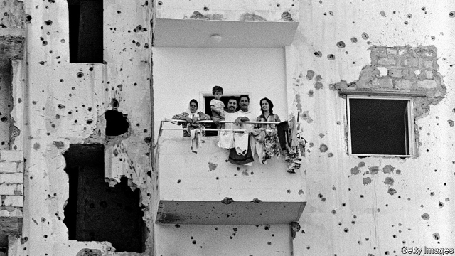

###### Anti-cementism in Lebanon

# Beirut is still arguing over its post-war reconstruction 

 

> print-edition iconPrint edition | Middle East and Africa | Jul 13th 2019 

ASIDE FROM its name, Beirut Souks could be anywhere. Gone is the labyrinth of alleys that rambled down to the port. Instead, soulless walkways lined with shops sporting global brands have buried the maze of spice and gold markets that once were filled with the braying of donkeys. The grand edifice pockmarked by shells that formerly housed L’Orient-Le Jour, Lebanon’s French-language newspaper, is a lone reminder of the grandeur that used to prevail around the Souks. 

Few projects arouse Lebanese passions as much as the rebuilding of Beirut. Some praise it for raising the city, phoenix-like, from the ashes of its 15-year civil war that ended in 1990. Others complain that it has let tycoons and politicians evict a jovial medley of religions and classes from the old city to grab its best real estate. 

For the project’s supporters, it is enough that Beirut has revived at all. The war had left Lebanon bankrupt. So a building magnate, Rafik Hariri, was elected its prime minister. He let Solidere, a new company in which he was a shareholder, requisition chunks of land in the centre. But before he was assassinated in 2005, he equipped the city centre with its own electricity and fibre-optic network, while the rest of Beirut suffered blackouts and a snail-paced internet. Hariri built tunnels en route to the airport, avoiding hellish traffic jams. Devastated churches and mosques rose up again. The Place de l’Etoile, a star-shaped plaza with a clock-tower in the middle, resurfaced as if the war had never happened. “Solidere brought Beirut back from the dead,” says Jamal Saghir, a Lebanese former bigwig at the World Bank. 

But critics say Solidere ousted ordinary folk—and destroyed more houses than the war had done. It aimed to attract a new class of people with the new, pricey buildings. Glitzy stores selling Gucci bags pushed out local schools and old shops. Politicians, including Hariri’s son Saad, Lebanon’s present prime minister, took up residence behind barricades guarded by private-security firms. “But you have to imagine how keen Lebanese were to get on with things and erase the memory of the war,” explains one of its planners. 

Still, Place de l’Etoile feels as empty as it once did when it was a no-man’s-land that people scuttled across for fear of snipers. It serves as a buffer between the Christian, Sunni and Shia zones into which the war divided the city. “Reconstruction destroyed downtown as a space for mixing,” says Mona Fawaz, a professor of urban planning at the American University in Beirut. “It finished the work of the war.” 

