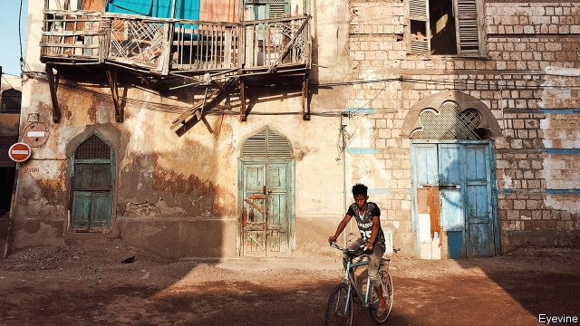

###### Where’s the peace dividend?

# Eritrea’s gulag state is crumbling 

 

> print-edition iconPrint edition | Middle East and Africa | Jul 13th 2019 

ABIY AHMED’S arrival in Asmara on July 8th last year was as colourful as it was historic. Thousands thronged the streets of the Eritrean capital to witness the first visit by an Ethiopian leader since the two countries fought a bloody war from 1998 to 2000. Both national flags fluttered along the boulevard from the airport; women carried plates of popcorn which they threw over the crowds in celebration. Eritrea’s ageing dictator, Issaias Afwerki, beamed as he embraced his young counterpart and signed a peace deal to end two decades of enmity. “There is no border between Ethiopia and Eritrea,” Abiy declared. “Instead we have built a bridge of love.” 

The promise of peace was tantalising. Telephone lines and flights between the two countries were restored. Two months later the land border opened. For the first time in years Eritreans could leave their country freely. Many thought that, with the war over, Issaias would soon enact other reforms. They particularly hoped he would end the system of indefinite conscription that the UN likens to mass enslavement—and which has helped earn Eritrea the nickname “the North Korea of Africa”. 

A year later Eritreans are still waiting. “Nothing has changed,” says Milena, a 16-year-old who faces being called up next year. The government has yet to say whether an old 18-month limit on conscription will be restored. Some recruits are now paid salaries and put to work in government offices, rather than brutal army bases in the desert. But there are no signs that Issaias will end conscription entirely. 

Without explanation, Eritrea has once more closed all its border crossings with Ethiopia, ending a short-lived boom in cross-border trade. Food prices are rising. Markets in Asmara, which briefly bustled with Ethiopian traders, are quiet. Businesses and factories are closing, some because of a shortage of raw materials. Some water-bottlers, for instance, have shut for want of imported plastic. 

Local authorities have stepped up the demolition of unlicensed homes. After the peace some residents began renovating or building new houses, wrongly assuming the government would loosen rules that effectively bar private construction. They are being bulldozed. 

Even officials are perplexed. Some have stopped coming to work because they have not been told what to do. Their offices, in departments such as trade and education, stand empty. Issaias has held only one cabinet meeting since the peace deal. 

Patience in Addis Ababa, the Ethiopian capital, is starting to wear a little thin. A draft trade agreement was sent to Asmara for comments late last year, according to insiders, but nothing has been heard of it since. Landlocked Ethiopia’s dream of using Eritrean ports, a huge potential benefit of the thaw, seems a long way off. The Eritrean Red Sea town of Massawa is “as dead as always”, remarks a visitor. 

The most vexing issue of the peace deal, the physical demarcation of the border, appears to have been kicked into the long grass. Disputed areas such as Badme, the one-goat village over which the war started, remain under Ethiopian administration. Troops eye one another across the dusty frontier. 

With neither a war to justify his repressive dictatorship, nor any promise of reforms to placate long-suffering citizens, Issaias’s grip on power seems to be weakening. For the first time in years, says a military officer, people are openly complaining in neighbourhood meetings, despite the threat of being denied state rations for doing so. “I see many people calling for his resignation,” he says. In recent weeks residents of Asmara have woken up to fresh graffiti calling for an end to conscription. Seditious pamphlets printed in Ethiopia, as well as two new television channels linked to the exiled opposition, are stirring anger. “Silent protest is growing,” says another army officer. “When we meet in the military camps, we talk about the wrongdoings of this government.” 

But rather than taking to the streets, Eritreans are emigrating. Despite the closed border, many steal away. Soldiers, who once shot at those trying to sneak across the frontier, now turn a blind eye. More than 60,000 Eritreans have registered as refugees in Ethiopia since September. 

Issaias does not face much international pressure. In November the UN lifted an arms embargo first imposed in 2009. He has also mended fences with Sudan and Somalia, and has drawn closer to the United Arab Emirates and Saudi Arabia. 

Even so, he seems concerned about the possibility of protests. He appears less frequently in public. He has shut down health centres run by the Catholic church (apparently because its bishops criticised him) and is arresting people at random. Social media have been blocked for weeks. Some internet cafés have been closed. “The government seems to fear the Sudan revolution might happen in Eritrea,” muses an employee at the agriculture ministry. 

Yet unlike in Sudan, where protests forced out a veteran despot, Omar al-Bashir, there are few young folk left in Eritrea. Barely 1% of the population uses the internet, so it is hard to organise protests online. “It will not be done on the streets,” says Zecarias Gerrima, a former journalist who is now in exile. A coup is more likely, though Issaias may be able to hang on. His country, meanwhile, is emptying.  

