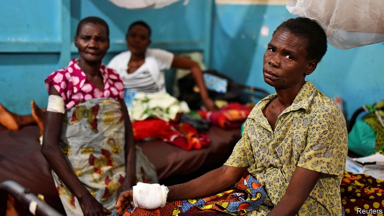
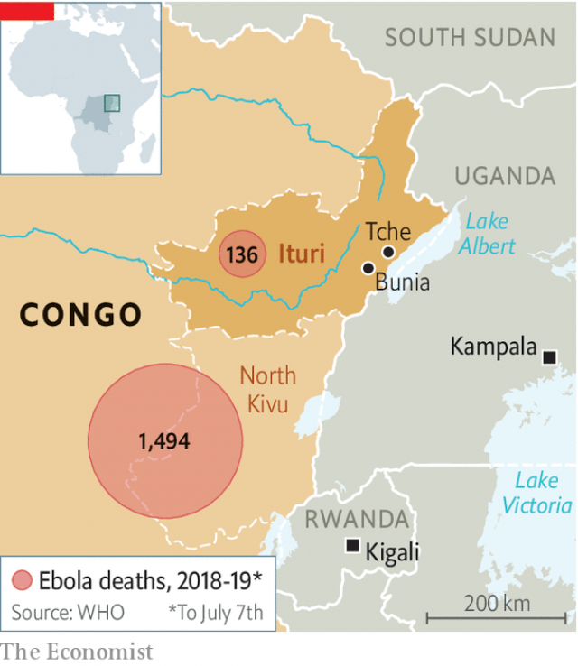

###### Ituri’s injuries

# Killings in Congo’s north-east spark fears of a return to war 

 

> print-edition iconPrint edition | Middle East and Africa | Jul 13th 2019 

AS HE SLIPPED out of consciousness, Batsi Lokana watched the militiamen who had attacked him slice off his mother’s head. When he came to, her body was gone. “Either they ate her, or they threw her into the river,” he surmises from his hospital bed in Bunia, the capital of the Democratic Republic of Congo’s Ituri province. Given Ituri’s history of gore, it is not a far-fetched conclusion. The past two decades have seen civil war, mass killings, systematic gang-rape and a vile scramble for loot. For some militias, cannibalism is just another way to terrify one’s enemies. 

Last month saw a reprise of the violence as Ituri’s cattle-herding Hema and seed-sowing Lendu ethnic groups again turned on each other. Armed men emptied villages, burned down houses, hacked bits off their occupants and ripped the fetus out of at least one woman. A mass grave found in the village of Tche contained 161 bodies, babies and small children among them. 

At least 276 people have been killed, estimate activists in Bunia. Some 300,000 more have fled, aid workers reckon. Most of the victims have been Hema. It was the worst violence since late 2017 and early 2018, when scores were killed and hundreds of thousands more fled before an uneasy calm returned. 

Outsiders often assume that the fighting springs from ancient ethnic hatred. It does not. True, the Hema and Lendu have been at each other’s throats for some time. But their enmity has been fostered, and perhaps even brought into being, by outside forces. Belgian colonists favoured the Hema, just as they did the Tutsi in neighbouring Rwanda. Mobutu Sese Seko, Congo’s post-independence dictator, gave plum posts to the Hema, who acquired much of Ituri’s finest land. The more populous Lendu looked on resentfully. 

 

Such tensions are easy to exploit. Hema and Lendu militias have been armed in the past by outsiders with an eye on the gold that studs Ituri’s riverbeds and the oil beneath Lake Albert. Mr Lokana reckons that the men who killed his mother were members of CODECO, a Lendu agricultural collective established in the 1970s. Farming support groups are not normally peopled with killers. CODECO, however, is long believed to have had a sideline in mysticism and fetishism. Nursing land-related grievances against the Hema, it is also accused of radicalising and training Lendu fighters. 

Hema representatives say that CODECO fighters have started much of the violence (although some Lendus have been killed too). Its fighters, some wearing hats with a bullet dangling from them as a charm, have been accused of ritually eating Hema flesh. Many suspect that the group, which seems to have petrol, weapons and ammunition in abundance, is backed by one of Congo’s meddlesome neighbours. The violence was far from spontaneous, says Victor Ngona, a Hema leader in Bunia. “This was planned. You don’t just wake up one morning and start cutting people up as if they are trees.” 

Ituri was one of the bloodiest theatres of the second Congo war of 1998-2003. Militias butchered at least 55,000 people. Much of the violence can be blamed on the invading Rwandan and Ugandan armies. Both countries used proxy militias to plunder Congo’s mineral resources. Uganda backed and armed Lendu militias. Rwanda threw its weight behind the Union of Congolese Patriots (UPC), a Hema militia that had previously enjoyed Kampala’s support. 

The tit-for-tat massacres reached a peak as Uganda, under international pressure, withdrew its troops from Bunia in 2003. Lendu militiamen, some wearing human livers round their necks, poured into the town. The UPC then displaced them. Each time Bunia’s civilian residents paid the price. Child soldiers sauntered drunkenly down streets lined with corpses that had been half chewed by Bunia’s dogs. Ducks gobbled up pieces of human flesh. Tens of thousands fled to UN compounds, but the peacekeepers, lacking a mandate to protect civilians, could do little—even when the militiamen taunted them by tossing bodies over the razor-wire. 

With some people warning of genocide, foreign powers were galvanised into action. French troops cleared Bunia of the militias. Order was mostly restored, holding for more than a decade. The International Criminal Court jailed Thomas Lubanga, the UPC’s leader, for 14 years in 2012. Bosco (“The Terminator”) Ntaganda, a commander in the militia, may face a life sentence after the court convicted him of war crimes on July 8th. Two Lendu militia leaders were also tried. One was acquitted. 

Yet much was also left undone. Grievances over land and marginalisation have remained largely unaddressed. A wave of land-grabbing in recent years has increased resentment among the Lendu. Although most of the militias were disbanded, little effort was made to reintegrate their members into society. Drifters from the conflict, skilled in pillage but unable to find gainful employment (of which there is little), have left a deep pool from which groups like CODECO can recruit. 

Although there are officially no foreign troops on Congolese soil, Ituri is in danger of reliving its past. As in 2003, tens of thousands of terrified civilians are again sheltering in schools, churches and a handful of cash-strapped camps. Ebola, which broke out in neighbouring North Kivu province last year, is adding to the misery, killing 136 people in Ituri. New cases were reported in Bunia last month. 

The Congolese army is a bit more disciplined than in 2003, when its soldiers in Ituri sold their weapons to Lendu rebels. It recently chased the militiamen out of their hideouts in the woods. Halting the fighting will be tough, however. The army has dispatched some troops, as has the UN peacekeeping force in Congo, but most are pinned down by conflicts elsewhere in the country. The militiamen may have been beaten back, but they are still armed and hiding out. A desire to avenge recent attacks is likely to grow. Unless the violence can be checked, Ituri’s residents will fear that the ghosts of their recent past are being reawakened. 

