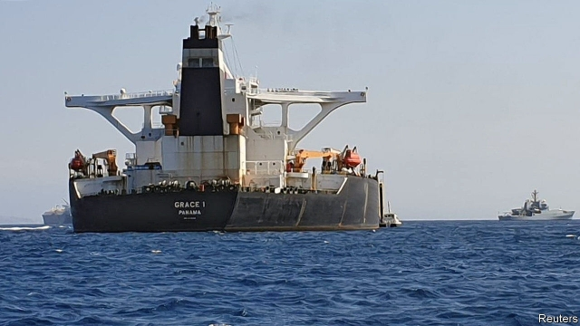
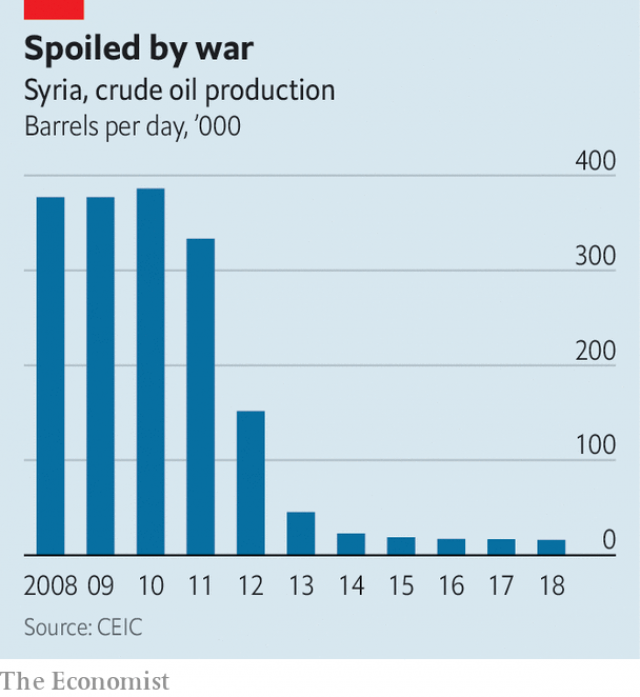

###### Tankers away

# Oil shortages in Syria are starting to hurt 

 

> print-edition iconPrint edition | Middle East and Africa | Jul 13th 2019 

THERE WAS little grace to the Grace 1’s journey, a 12,000-mile (19,000km) slog around the Cape of Good Hope that came to an inelegant end off the coast of Gibraltar. In the early hours of July 4th British marines roped down from a helicopter to seize the tanker, which held 2m barrels of Iranian oil. Britain says the cargo was bound for Syria, and that by traversing European waters it violated European sanctions. It has not been a good summer for tankers trying to reach Syria. Last month mysterious explosions damaged undersea pipelines that carry oil from vessels to the refinery at Baniyas, temporarily halting imports. Bashar al-Assad’s regime blamed saboteurs. 

Throughout Syria’s savage civil war, loyalists liked to daub a slogan on walls: “Assad or we burn the country.” They got both. Syria’s GDP, as best anyone can tell, is 60% lower than pre-war levels. The Syrian pound trades at 500 to the dollar instead of 50. Rebuilding will cost $250bn, reckons the UN, four times Syria’s annual economic output before the war. Mr Assad rules the ruins—and is finding it hard to keep the lights on, especially with one of his closest allies deep in its own economic crisis. 

With its finances in tatters, the regime has been forced to cut subsidies. The price of petrol has almost tripled since the start of the year. A full tank would cost a civil servant half a month’s pay. In any case, filling up is impossible because rationing was imposed in April. Most drivers can only buy 20 litres every five days. They wait in long queues for this meagre allotment. 

Before the war Syria produced about 385,000 barrels of oil a day. Most was put to domestic use. Output is now less than one-tenth of that. Iran helped fill the gap for several years, supplying about 50,000 barrels a day on easy terms, equivalent to more than one-third of Syria’s current consumption. But with Iran under harsher American sanctions that has become untenable. It stopped the handouts in October. Fuel shortages soon followed in Syria, as did blackouts during a cold winter. 

 

Syria can still buy Iranian oil at market prices—indeed, it is one of the few customers willing to ignore sanctions to do so. Even that is fraught, however, as the saga of the Grace 1 illustrated. The tanker switched off its transponder in April to load cargo, a common practice for ships that wish to avoid scrutiny while taking on Iranian crude. Then it steamed south-east on its roundabout route to the Mediterranean. 

The Suez Canal would have been more direct, but the heaviest tankers cannot sail straight through. They must offload their cargo first and have it piped to the other side. The pipeline is partly owned by Saudi Arabia, which forbids Iran from using it. And maritime-traffic data suggest that Egyptian authorities may be blocking lighter vessels from crossing Suez if their destination is Syria. One tanker, the Sea Shark, has been anchored near the canal’s southern entrance since April. America’s Treasury Department had added it to a list of vessels that carry oil to Syria. 

That leaves the long route around Africa, and the risk of interception in European waters. Iran cried foul after the Grace 1 was seized. Abbas Araghchi, Iran’s deputy foreign minister, says it was not going to Syria but “somewhere else”. Iran also threatened to retaliate. On July 10th a British warship drove off Iranian boats trying to “impede” a British tanker. Relations are already fraught. Iran is angry that European powers have not done more to offset America’s sanctions and preserve the deal it reached in 2015 to restrict its nuclear programme in exchange for relief from some sanctions. The tanker incidents will not help. 

As for Mr Assad, he may seek help from his other close ally. Russia is already shipping wheat from Sevastopol, in occupied Crimea, to its military port in Tartous, Syria. Oil may be the next commodity. But Vladimir Putin will probably not be generous with the terms—and Mr Assad can ill afford to pay. “Let’s grant that he won the war. He did that,” says a European official. “But he can’t win the peace.”  

