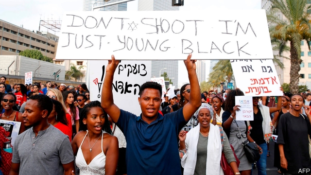

###### Problems in the promised land

# The killing of a black Jew sparks protests in Israel 

 

> print-edition iconPrint edition | Middle East and Africa | Jul 13th 2019 

THE VIOLENT protests that shook Israel on July 2nd had all the hallmarks of race riots. A young black man had been shot dead by an off-duty policeman in unclear circumstances. Thousands of Ethiopian Jews took to the streets, throwing stones at police officers, blocking roads and overturning police cars. Their claims of systematic racism and police brutality were met, on the whole, with condescending denial. Politicians chided them for the violence, while issuing vague expressions of sympathy. Few bluntly mentioned the word racism. Media outlets and pundits supporting the government aired conspiracy theories suggesting that left-wing organisations had incited the violence. 

Nearly all the Jews in Ethiopia, whose ancestors had lived in Africa for centuries, moved to Israel quite recently. Big airlifts began in the 1980s, when Ethiopia suffered tyranny and famine. A sympathetic Israel welcomed them with open arms, though rabbis had long debated whether the Beta Israel, as they are known, were really Jewish (and therefore eligible for Israeli citizenship). Today there are 150,000 of them in Israel (1.7% of the population). 

They have suffered a range of indignities (though none to compare with life as it was back in Ethiopia). The Chief Rabbinate, which regulates marriage, demanded that they undergo a full conversion process to Judaism. Health authorities rejected their blood donations, fearing HIV. 

Complaints of racism have been generally dismissed. In 2012 an immigration minister scolded Ethiopian-Israeli activists, telling them to “say thank you for what you have received”. 

Ethiopian-Israeli minors are three times as likely to be arrested as their non-black counterparts. In 2016 Israel’s police commissioner said it was “natural” for his officers to be more suspicious of Ethiopian-Israelis (and indeed Israeli-Arabs). The justice ministry’s anti-racism unit says the number of arrests has dipped since then, but the Ethiopians still feel “overpoliced”. 

“Despite all the efforts to integrate into Israeli society, the feeling of young men and women confronted every day with racist remarks is that when they get pulled over by police they have nothing to lose,” says Asher Seyoum, a former member of parliament and the first Ethiopian-Israeli to have been appointed head of the Jewish Agency in Addis Ababa, Ethiopia’s capital. 

Unlike most previous waves of immigrants to Israel, who often arrived well-schooled and credentialled, most Ethiopian Jews had been subsistence farmers. Few arrived with the skills to thrive in a high-tech economy. 

It is taking time for them to catch up. Among the younger generation of black Jews, most were born in Israel or have spent most of their lives there. In the past decade only 22% who left high school went on to higher education, half the national average. That is progress, of course. Children raised in families with little tradition of literacy seldom do as well as those from more bookish backgrounds. But many would like to see them catch up faster. 

A classic Israeli comedy sketch shows each wave of Jewish immigrants over the past century or so—from Russia, Poland, Yemen, Germany and Morocco—arriving on the promised land’s shore and immediately joining those already on the beach to hurl abuse at the next wave. The most recent wave, from Ethiopia, faces tougher obstacles than most. 

