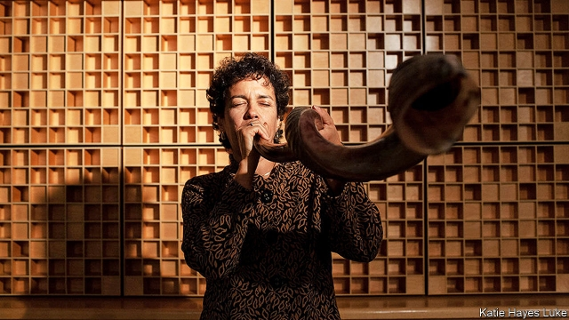

###### Call of the ages

# Obituary: Jennie Litvack died on June 27th 

 

> print-edition iconPrint edition | Obituary | Jul 13th 2019 

THE CALL came, appropriately enough, while she was walking through the Old City of Jerusalem, her husband said. They had stopped at a small shop near the Roman Cardo. By the door stood a barrel of shofars. Not regular ram’s horn shofars, but the long curved Yemeni instruments made from the horn of the greater kudu, an African antelope. She blew each one in turn. What emerged was a deep throaty musical summons that almost quivered, casting those who heard it back to one of the most significant moments in Judaism when God stopped Abraham from sacrificing his own son and ordered him to kill a ram instead. 

In the street a crowd began to gather. They had never heard such a sound before. And then, somewhere in the barrel, she found it—the shofar that produced the perfect deep baritone, the primal call she’d long dreamed of but never made. When she blew it, the crowd fell silent. Shopkeepers, tourists, old men pushing carts: they all stopped. They knew this one was different. And so was born a new ba’alat tokeah, a high mistress of the horn. 

It helped, of course, that she had played the trumpet since she was a child. At 14 she went up to Dizzy Gillespie after a concert at the Rising Sun jazz club in her native Montreal, and asked if she could have a go on his instrument—and a lesson. The next morning her mother dropped her at his hotel and waited patiently in the car outside. An hour passed. Then two. Then three. After four hours, her mother knocked on the door. There they were, the two of them—the father of Be Bop and the curly-haired teenager with the smiling eyes—laughing, playing backgammon, learning to twang the Jew’s harp, just being friends. They remained friends for the rest of his life. He called her his god-daughter. She named her first son Benjamin Diz. 

For a while she considered applying to a music conservatory after high school. When instead she chose to major in public policy at Duke University, she took her trumpet into the marching band. She played it, too, when she went on to the Fletcher School of Law and Diplomacy to write up her research that proved that in poor countries people were better off, financially and medically, if they were asked to pay a little bit of the cost of ensuring a supply of drugs to their local pharmacy rather than if they paid nothing—and got nothing. She played the trumpet some more when working as an economist for the World Bank, in northern Cameroon, Vietnam and Morocco. And then, at 43, having just had her last son, she decided to follow what she called her still, quiet voice and be part of a movement to revitalise Jewish spiritual life in America. 

She resigned from the World Bank and joined the Adas Israel synagogue in Washington, DC, where in 1876 Ulysses S. Grant became the first American president to attend a service in a synagogue. There was meditation every Tuesday night, yoga every Wednesday night, lessons in Jewish mindfulness all through the week. But it was when she held aloft the shofar that she really found her voice. 

After every morning service through the month of Elul, then through Rosh Hashanah—Jewish new year—on to Yom Kippur, the day of atonement, Rabbi Lauren Holtzblatt, her friend, would call out: Tekiyah. She would respond with a single note, the awakening summons to Jews to focus on the year that has passed and think about the type of people they would like to be. Shevarim, the cry from the heart, the triptych of notes that speak of a sense of brokenness. Teruah for the nine staccato notes that, like an alarm clock, she would say, would summon the listener, “Wake up, wake up, wake up. Now is the time to do something.” And then Tekiyah gedolah, the final long note, that refers to a oneness, a total unity coming together. Over 100 notes in all, more than an orchestral hornplayer would expect to sound in an evening concert, blowing the shofar at Rosh Hashanah is a challenge that takes knowledge of the tradition, technique and spiritual engagement. 

The shofar is usually men’s business. As a woman, she had to be twice as good. She had help, she said—a perfect shofar, carved to fit her mouth exactly by a man called Shimon who lived on the Golan Heights and knew just enough English to tell her: “Blow!” There was also, she believed, divine assistance. At home when she took her deepest breath for the Tekiyah gedolah, she could manage only 40 seconds. But in the synagogue she managed to stretch that out to nearly a minute. Her son had timed her. And then there was how people responded to her call: the women who told her how welcoming her blowing made the Rosh Hashanah service for them, the National Public Radio listeners who heard her speak of her passion for her instrument and her encounter with Gillespie, the Justice on Israel’s Supreme Court—an Orthodox Jew no less—who invited her to blow the shofar at the court itself, the joggers in Central Park who slowed down and then stopped to watch when she accompanied Alicia Svigals on the klezmer violin, playing “Amazing Grace”. 

Along with the birth of her sons, she liked to say that blowing the shofar brought her closer to God than anything else in her life. Even after her metastasing cancer meant the removal of a large part of both her lungs, she would take up her instrument with kavanah, “intention”, close her eyes, shut out the world and concentrate on her breath, her shofar, her soul. 

In the Old Testament the Book of Genesis says that God formed man out of dust from the ground when He blew into his nostrils the breath of life. The Hebrew word for soul, neshama, is intimately connected to the word for breath. Her breath had shushed her boys to sleep in their crib, it whooshed out of her whenever she jumped naked, as she liked to do, into a Canadian mountain lake, and it transported Adas Israel’s congregation to Mount Sinai when it blew air into her shofar. That breath may have been stilled, but like Abraham’s horn it lives on. At the start of her funeral, the shofar was sounded by her three sons. 

