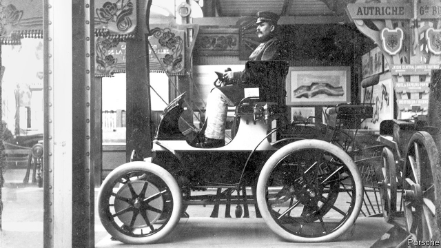

###### Automotive engineering

# A new type of engine for electric cars 

 

> print-edition iconPrint edition | Science and technology | Jul 13th 2019 

AT THE DAWN of the motor industry one of its pioneers, Ferdinand Porsche, caused a sensation at the Paris World Fair in 1900 with a vehicle driven by a pair of electric motors incorporated into its front wheels. This arrangement allowed the Lohner-Porsche (pictured above) to dispense with cumbersome belts, chains and gears. It was thus able to nip along at a heady 35kph for up to 50km after its lead-acid batteries had been charged up. 

Porsche, like other carmakers of the time, eventually turned to the internal-combustion engine for greater range and flexibility. His eponymous firm went on to build some of the fastest sports cars around. But despite the fact that electric vehicles are now returning to the road with a vengeance, the idea of using “in-wheel” motors of the sort Porsche pioneered has failed to follow suit. Some vehicle manufacturers and their suppliers, including Michelin, a French tyremaker, and NSK, a Japanese component-producer, have developed modern versions of in-wheel drives for cars, but these have yet to make it into production models. 

There are two reasons for this reluctance. One is that an in-wheel motor’s components and wiring are exposed to the elements rather than being snug inside a vehicle’s body. They must therefore be robust enough to handle the high voltages such motors normally require while simultaneously being protected against damage from road debris and the risk of shorting out when periodically soaked in water. The other concern is that the additional weight of the motors on each wheel increases a vehicle’s “unsprung” weight—the part of its mass not supported by its suspension. A high unsprung weight results in a bumpy ride and poor handling. 

All this means that most electric cars continue to use drivetrains that resemble those found in combustion-engined vehicles. They have an electric motor at the front or the rear (or, sometimes, both) which turns the wheels via shafts and gears. But if Indigo Technologies of Cambridge, Massachusetts has its way, all this will change. Since the firm was founded in 2010 by Ian Hunter, a professor of mechanical engineering at the Massachusetts Institute of Technology, Indigo’s engineers have been developing an in-wheel drive system they call the T1. They believe that their system, a module that incorporates brakes, steering and an active suspension, as well as a motor, overcomes both the electrical problem and the unsprung-weight problem, thus paving the way for in-wheel drives to become mainstream. 

To reduce the electrical difficulties, the T1 runs at 48 volts instead of the 400 volts or more used by the motors in existing electric cars. The choice of 48 volts is not arbitrary. That voltage is also rapidly becoming standard for the circuits which run things like lighting, climate control, entertainment systems and adjustable seats, even in conventional combustion-engine-driven cars. Lowering the voltage almost tenfold in this way does, though, make the T1’s motor easier to protect and insulate, which in turn makes it cheaper to produce than higher-voltage motors, says Brian Hemond, Indigo’s boss. 

All this is possible because fitting T1s to all four wheels eliminates the need for driveshafts, transmissions, suspension parts and other weighty components. Those weight savings allow the size of the battery pack to be reduced, saving still more weight. 

Reduced vehicle weight means also that the propulsive motors do not need to be as powerful as those of conventional electric cars—especially as the task of propulsion is divided four ways between them. Nor are any gears involved, for the motors turn only as fast as the vehicle’s wheels, which is a relatively low speed for an electric motor and further reduces its need to be powerful. That translates to a low voltage because the power of such a motor is a product of voltage and current (P=V*I, one of the fundamental equations in electricity). At a constant current, voltage can be reduced. 

All this frees up space elsewhere in the vehicle, allowing an electric car to be designed from scratch to be more efficient and therefore cheaper to run. Other benefits also come from lightness. A smaller battery can be topped up more effectively by the regenerative braking built into the module, as well as being faster to recharge when plugged into the mains. Indigo has tried the T1 out on prototype cars redesigned to be more aerodynamic. It reckons these prototypes need only a tenth of the power required by a combustion-engined vehicle, even at highway speeds. 

A combination of a lighter vehicle and lighter components in the T1 modules also reduces the amount of unsprung weight. As for ride and comfort, the active suspension and the ability to control separately the power applied to each wheel permit better grip and increased stability during braking and cornering. 

Indigo is talking to carmakers and components firms and hopes, by the end of the year, to land its first production contract. Dr Hemond expects particular interest from firms developing ride-sharing and autonomous vehicles. The sort of small, sleek vehicles or personal-mobility pods which such in-wheel drive systems might inspire would be a world away from the perambulatory Lohner-Porsche. But they would have made Porsche himself wonder what might have been had he stuck with the electric motor. 

