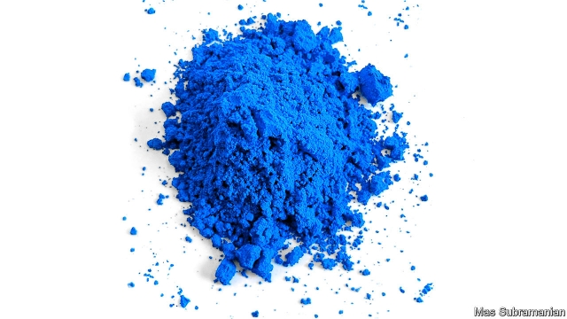

###### Pigments

# A team of chemists are searching for a new red pigment 

 

> print-edition iconPrint edition | Science and technology | Jul 13th 2019 

HUMANS ARE creatures with sophisticated colour vision, so the market for pigments is big—about $30bn a year. In this marketplace, however, not all colours are equal. In particular, bright reds, much desired for their attention-grabbing qualities, are tricky to make, and each of the existing options has flaws. 

The especially vivid reds made from cadmium, lead and mercury are toxic and so their use is now restricted. Cochineal, created by crushing up Dactylopius coccus, a species of scale insect, is safe to handle and consume, but its safety is trumped in the minds of some by its animal origin. A campaign by vegans in 2012, for example, forced Starbucks to remove cochineal from its Strawberry Frappuccinos. Other red pigments, meanwhile, either start off dull (oxides of iron) or fade to dullness unless given special protection from ultraviolet light (Pigment Red 254, the source of Ferraris’ characteristic scarlet livery). The hunt is therefore on for a non-toxic, non-controversial, chemically stable red. 

One of those searching is Mas Subramanian, a materials scientist at Oregon State University. Dr Subramanian already has one new pigment to his name. In 2009, when trying to find a material known as a multiferroic, which has distinctive electronic and magnetic properties, one of his research students mixed oxides of yttrium, indium and manganese and heated them to 1,200°C. The result was a powder as brilliant as a bluebird’s wing. YInMn (pictured), as it is now known, was the first new blue discovered for two centuries. 

The perfect red has so far eluded Dr Subramanian—in part because it is hard to predict the colour of a material before you make it. Small alterations to a crystal’s structure can dramatically alter which parts of the spectrum that crystal absorbs and which it reflects. The green of emeralds and the red of rubies, for instance, are both caused by chromium atoms, but the atoms in question are bonded into their respective lattices in different ways. 

As it happens, rubies are one of Dr Subramanian’s inspirations. His hope is that by piggybacking on the structure of their crystals—already known to yield an appropriately, well, ruby, colour—he might be able to reproduce the effect. A weakness of this approach is that rubies themselves make an unsatisfactory pigment. When crushed, they become pale pink. 

A second avenue may be more promising. Many inorganic reds, including those based on cadmium, lead and mercury, are semiconductors. Dr Subramanian and his team hope to use tin—a metal in the same group of the periodic table as lead—to produce a similarly vibrant, though non-toxic, semiconductor pigment. 

Inevitably, the semiconductor approach does bring problems of its own. A semiconductor’s colour depends on a phenomenon called its band gap. This is the ease with which its atoms can shed electrons. The process of shedding requires energy, often in the form of light, so a substance’s band gap helps determine which frequencies of light it absorbs and which it reflects. Unfortunately, band gaps can, themselves, be altered by exposure to energy in the form of heat or light. That changes the pigment’s colour. 

For example, mercury sulphide, known to painters as vermilion, has a small band gap. This means it absorbs much of the visible spectrum, reflecting only red because red light is insufficiently energetic to shift the relevant electrons. If the gap is diminished still more, as sometimes happens when vermilion is exposed to light, the pigment absorbs all visible light and turns black. Making a semiconducting red is not enough, then. It also needs to stay red when in use. And that essential property remains elusive. 

Dr Subramanian and his team have got close. The tin approach has resulted in some promising flame-bright superconducting oranges. But shrinking the band gaps of such materials just that little bit further, to the point where a brilliant red is reflected instead, has so far proved beyond their chemical skills. 

