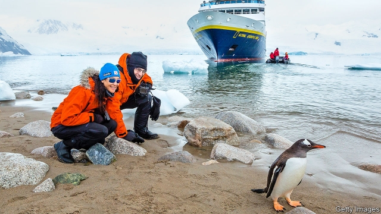

###### Conservation and tourism

# Contrary to the fears of some, penguins and people do mix 

 

> print-edition iconPrint edition | Science and technology | Jul 13th 2019 

IN 1969 A cruise ship called MS Lindblad Explorer, the first vessel purpose-built for such a trip, and carrying 90 passengers, arrived in Antarctic waters. Since then, Antarctic tourism has increased dramatically. Nowadays, well over 35,000 visitors a season make landfall in the austral summer. Most of these landings take place on the Antarctic peninsula and its adjacent islands, with the intention of visiting colonies of gentoo penguins. 

That worries many conservationists, who fear such quantities of people may be disturbing the penguins, to the birds’ detriment. However, a study just published in Polar Biology by Maureen Lynch of Stony Brook University, in New York, brings good news for penguins, tourists and tour-operators alike—for, as far as Dr Lynch can determine, the tourists’ visits are not stressing the birds at all. 

The conventional way of deciding whether visits by tourists are stressful to the animals so visited is to recruit a bunch of PhD students to observe those animals and make copious behavioural observations when tourists are and are not present, in order that the two may be compared. This is arduous and expensive, for even PhD students, lowly as they are, need to be housed and fed. An alternative is to sample the animals’ blood and analyse it for stress hormones such as corticosterone. The problem with this is that catching animals to measure their hormone levels is, of itself, stressful. 

There is, however, a third way, which is to look for stress hormones in animals’ droppings. Dr Lynch knew from previous work by her collaborators at the University of Houston that corticosterone and its metabolites show up in penguin guano. Moreover, the data showing this hinted that corticosterone concentrations in guano went up shortly after animals were approached by human beings, and then returned to normal later. With that in mind, she decided to compare guano from penguin colonies visited by lots of tourists with those farther off the beaten track. 

She and her colleagues therefore visited the Antarctic peninsula during the tourism seasons of 2017-18 and 2018-19. Once there they collected 108 guano samples from 19 gentoo penguin colonies and returned them to the laboratory for analysis. A few of the sites sampled (like Bryde Island and Moot Point) are hard to get to and never see tourists. Others see between 5,000 and 15,000 visitors a season. One (Neko Harbour) sees more than 20,000. 

As the researchers expected, all the samples contained corticosterone and its associated metabolites. Contrary to their expectations, however, there were no significant differences between samples from different sites, regardless of the number of visitors those sites played host to. It seems, then, either that penguins do not worry about human visitors in the first place, or that they quickly get used to them, which is good news all round. What is more, Dr Lynch’s method provides an easy way to monitor the situation. If it does transpire that, as tourist numbers grow, they cross a threshold where they become oppressive to the birds, it will be possible to advise tour operators of the fact and ask them to put their charges ashore to look at less-visited colonies. 

