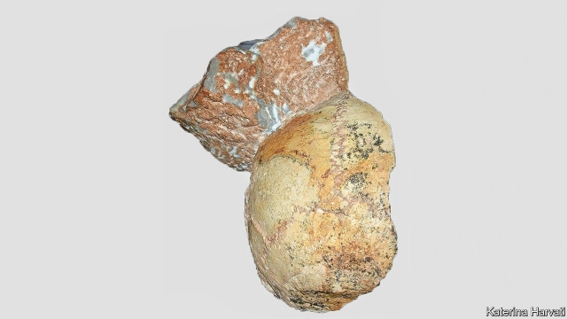

###### Human origins

# The oldest known Homo sapiens outside Africa was Greek 

 

> print-edition iconPrint edition | Science and technology | Jul 11th 2019 

EARLY HUMAN fossils are so rare that each new discovery may rewrite the textbooks. A chance find two years ago in Morocco, for example, pushed the origin of Homo sapiens back to at least 315,000 years ago, from a previous minimum of 260,000 years based on remains found in South Africa. Now, as they report in this week’s Nature, a group of palaeontologists have extended the known geographical range of early Homo sapiens from Africa to Europe. 

Katerina Harvati of the University of Tübingen, in Germany, and her colleagues found the relevant skull fragment not in the ground, but in a museum in Athens. It was one of a pair of specimens dug up in the 1970s from Apidima, a cave in southern Greece. Both were recognised as being human fossils of some sort, but had not been dated or properly analysed. Dr Harvati and her team have now done so, using techniques unavailable to the original finders. 

One fossil is a reasonably complete, though fragmented, skull. Radioisotope dating shows it is 170,000 years old. Computer reconstruction reveals it to be an example of Homo neanderthalensis, Neanderthal man, a species widespread in Europe until 40,000 years ago, when Homo sapiens took over. The other fossil, the back half of a cranium (pictured, attached to some rock) turned out to be Homo sapiens. It is 210,000 years old, and thus the third-oldest known example of modern humanity. 

That is interesting. But what has excited attention is that it is also the oldest Homo sapiens specimen found outside Africa—the continent where, according to all the available evidence, the species originated. 

How Homo sapiens spread from Africa to dominate the world is a story that once looked simple, but is getting rapidly more complex. Genetic data suggest most people alive today who are not African or of recent African descent can trace their ancestry to one or a few “out of Africa” migrations that began about 60,000 years ago into Asia, and thence spread to Australia, Europe and the Americas. More detailed analysis, though, shows that on the way through these places some of those ancestral humans interbred with other human species, now extinct, including Neanderthals. 

Fossils also show that Homo sapiens was present in the Middle East well before 60,000 years ago. Not, however, as long ago as the inhabitant of Apidima whose remains Dr Harvati has now analysed. Why, having reached Greece, Homo sapiens did not continue to spread into the rest of Europe and thus take it over 170,000 years earlier than happened in reality is a mystery—perhaps one on which future fossil discoveries will shed a little light. 

Correction (July 11th 2019): An earlier version of the title of this piece incorrectly stated that the oldest known Homo sapiens was Greek. In fact this story is about the earliest specimen found outside of Africa. This has been updated 

