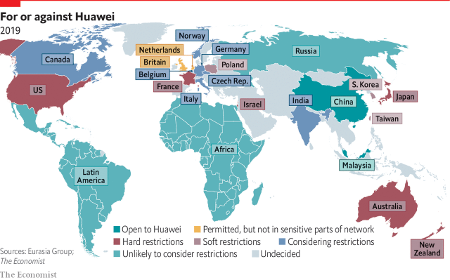

###### Security

# Companies must get ready for a riskier world 

 

> print-edition iconPrint edition | Special report | Jul 13th 2019 

MULTINATIONAL FIRMS have come a long way in the decades since the emergence of supply-chain management. A sclerotic and retrospective set of disjointed processes has formalised into a proper discipline. Decisions based on gut instincts and relationships are increasingly made using data. As a result, supply chains are getting shorter, faster and smarter. 

Unfortunately, they are not yet getting much safer. This matters because the world economy is becoming more dangerous for MNCs. Global supply chains are facing three immediate threats today: the Huawei problem, cyber-security attacks and tariff wars. Tomorrow’s threats, which include climate change, could be worse. 

What should firms do in response to American hostility towards Huawei? MNC bosses must balance security concerns and the need to follow American law against cost pressures and a desire to retain access to Chinese innovations and consumer markets. Though President Donald Trump indicated on June 29th that he would loosen restrictions on sales of American technology to Huawei, the Chinese firm remains a legal pariah. Its activities in America have been curtailed by executive order, and Congress has curbed its sales to defence contractors. The Eurasia Group, a risk consultancy, reckons that the truce agreed by Mr Trump and his Chinese counterpart, Xi Jinping, at the end of June does not provide “a sustainable solution for Huawei”. 

The Huawei blacklisting could be dropped completely as part of a final trade bargain. Last year Mr Trump decided to grant a lastminute reprieve to ZTE, another Chinese telecoms-equipment firm. But even if that happens in this case, Huawei is likely to have an enduring effect on global supply chains. 

For one thing, it has served as China’s Sputnik moment. The current generation of Communist Party leaders came to power in the age of China’s economic symbiosis with America. To their shock, Mr Trump’s economic nationalism and attacks on China have won over America’s corporate elite. 

Now that faith in interdependence is shattered, Chinese leaders will invest heavily to accelerate “indigenous innovation”, just as American leaders did following Russia’s launch of the Sputnik rocket in 1957. They will push home-grown operating systems and technical standards, and direct vast resources and the country’s sharpest minds to developing advanced technologies. Many bets will flop but others will pay off, even if they take decades (as is likely in the case of advanced semiconductors). 

That points to another likely effect of the Huawei troubles. There is bound to be an acceleration in the slow unravelling that is already under way of the complex supply chains that linked China to America. For example, Mr Trump issued an executive order in May that restricted sales of some foreign telecoms-networking kit. This is part of a broader policy review that may ultimately require future communications technologies sold in America to be manufactured domestically. 

The cost of ripping apart efficient supply chains (especially in electronics) and replacing them with more expensive substitutes would inevitably be paid by consumers, through higher prices and lost innovation, but also by firms and shareholders, through lower profits and reduced capacity to invest in future. There may also be macroeconomic costs. By the OECD’s reckoning, the rise of hyper-efficient global value chains kept producer-price inflation and real-wage growth in check, and boosted productivity levels across advanced economies by nearly 0.6% per year. 

Yet another effect concerns the rollout of 5G networks. This technology is the essential enabler of the internet of things, smart factories and digital supply chains. The Huawei fallout could lead to the bifurcation of global markets into two incompatible 5G camps (see map). Paul Triolo of Eurasia Group thinks it will “force countries and companies to choose sides between America and China in the tech cold war”. 

 

In this scenario, Sweden’s Ericsson, Finland’s Nokia and South Korea’s Samsung would supply a pricier network comprised of kit made outside China to serve customers allied with the United States. For example, Australia’s government, which is close to American intelligence agencies, banned Chinese 5G kit last year. Huawei would build a cheaper network for those countries less worried about China. Mahathir Mohamad, Malaysia’s prime minister, declared in May that his country plans to use Huawei “as much as possible” even if there “may be some spying”. 

As for cyber-security threats, they have gone from a distant danger to the enemy within. A single bit of Russian malware, known as NotPetya, in a Ukrainian office led to the shutdown of Maersk’s shipping operations at many ports in 2017, costing as much as $300m. Research by Zac Rogers of Colorado State University and Thomas Choi of Arizona State University suggests that over 60% of the reported cyber-attacks on publicly traded American firms in 2017 were launched through the computer systems of suppliers or contractors, up from less than a quarter in 2010. 

Stuart Madnick of MIT’s Sloan Business School believes that the rollout of 5G networks and the arrival of the internet of things could produce the next great cyber-crisis because firms are rushing suppliers to get whizzy devices onto the market without first incorporating proper cyber-security into the design. “The worst is yet to come,” he warns. 

The biggest question for company bosses today is how firms should rethink supply chains in an era of protectionism. The conventional wisdom is to invest in “resilience” by diversifying suppliers, building additional manufacturing plants, keeping bigger stocks and so on. In practice, though, bosses need to weigh carefully the costs involved in complex hedging strategies against promised benefits. Flex’s Tom Linton rejects the notion of resilience, which he considers a euphemism for expensive redundancy, in favour of speed: “I could drive to work in a tank if I wanted to be resilient, but it would take me for ever.” 

That is an extreme position. Others point to nuanced strategies that will require bosses to roll up their sleeves and learn by doing. Laurent Chevreux and colleagues at A.T. Kearney, a consultancy, argue that firms must be ready to pivot quickly, ensuring that modernisation of supply chains does not simply digitise old ways of thinking and hinder adaptability. Justin Rose and Martin Reeves of the Boston Consulting Group encourage firms to look at advanced manufacturing technologies, especially flexible robotics and automation, which might make supply chains safer by allowing firms to bring them closer to home. 

In conclusion, the great convergence that produced a golden age for MNCs is now unravelling. This will force companies to ask hard questions about investment decisions taken in the past, and may undo some of the global supply chains developed over the past few decades. This reconsideration must be taken on as an urgent strategic task by the people occupying executive suites, rather than delegated to bean-counters in cubicles. 

The traditional approach to building supply-chain resilience assumed that the threat would be a natural disaster that forced some capacity offline. So companies have mapped potential supply risks, run disaster scenarios and invested in “business continuity” solutions that generally involve duplicating capacity. 

However, this mindset is inadequate for dealing with trade wars. Tariffs imposed today can be removed next month, but factories cannot be moved around so fast. The task now is to redesign supply chains so that they can respond to geopolitics more quickly. This will require many firms to speed up cycle times for inventory. They must also shift from a default bias for efficient global suppliers on the assumption of a low-tariff world towards more local (and possibly pricier) sourcing, which may provide a buffer during tariff battles. However, excessive concentration also brings risks, so managers must invest wisely. 

Firms must also take steps to guard against cyber-risks, which are growing. Ryan Kalember of Proofpoint, an American cybersecurity firm, notes that this will be exacerbated by 5G, where many of the vendors involved have a history of shipping code with bugs in it. Mr Madnick recommends big firms conduct security audits of supply-chain partners, vendors and takeover targets to sniff out cyber-vulnerabilities. 

Many companies will struggle with the question of what to do with legacy manufacturing assets and opaque supplier networks developed in a bygone era. Others may adopt a wait-and-see attitude, hoping that the current storms will pass and that the heady globalisation of yesteryear will return. The most dynamic firms will find creative ways to chart a path through today’s challenging terrain and seize competitive advantage. 

After all, as this special report has made clear, supply chains are no longer merely cost centres. The best firms are already wielding shorter, faster and smarter supply chains as potent weapons. The next challenge will be to make them safer as well. It would be foolish to venture onto this battlefield unarmed. 

