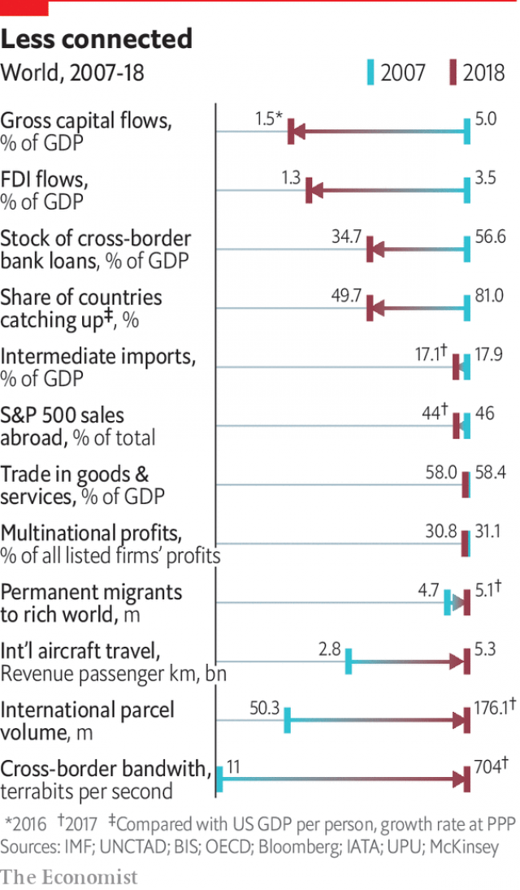

###### Slowbalisation

# Multinational companies are adjusting to shorter supply chains 

 

> print-edition iconPrint edition | Special report | Jul 11th 2019 

IN THE BOOM years of globalisation from 1990, one of the ideas that became gospel, spread by authors such as Thomas Friedman, was that the world had become flat. National boundaries mattered very little in terms of sourcing and manufacturing, went the argument. 

The idea was so pervasive, says Hau Lee of Stanford University, that “companies just built anywhere”. Now, as the outlook for globalisation grows cloudy, companies are starting to question the wisdom of the hyper-globalised supply chains thus created. Mr Lee reckons that managers at MNCs must now build new skills as they reconfigure supply chains for a “bumpy” new world. 

A survey conducted in April of 600 MNCs around Asia by Baker McKenzie, an American law firm, found that nearly half of them are considering “major” changes to their supply chains, and over a tenth a complete overhaul. In many sectors this will mean a rethink of the role that China plays in sourcing. There are two main reasons to expect that, after several decades of hyperextension, some supply chains will get shorter. First, it is now clear that stretching supply chains thin to make goods ever cheaper carries risks. And second, global trade now includes not just things you can drop on your foot, but a large amount of services. 

In terms of the risks, most MNCs do not know who supplies the supplier to their supplier, but they might be held hostage if that distant vendor cannot fulfil its obligations. The dangers are occasionally brought to light by external shocks. Sometimes these are delivered by natural disasters. In the wake of the Japanese tsunami in 2011 a global semiconductor giant tried to map its vulnerabilities to third- and fourth-tier vendors; it took a team of 100 executives more than a year to work out which firms were in its extended supplier networks. 

More recently, shocks have been political. Brexit, Britain’s messy departure from the European Union now scheduled to take place at the end of October, could disrupt supply lines linking Britain and the continent. MNCs have warned that they may reduce operations in Britain if it does. A survey by the country’s Chartered Institute of Procurement & Supply indicated that a fifth of continental businesses would demand a hefty discount from British suppliers for even a one-day delay at the border, while more than a tenth of British exporters expect contracts to be cancelled outright. 

Americans will not have to wait till October to see the impact of their political shocks, as Mr Trump’s tariffs on steel, aluminium and Chinese imports are already biting. A working paper by Mary Amiti and colleagues published in March by the National Bureau of Economic Research calculated that by the end of 2018 they had cost American consumers $1.4bn a month. Retailers are being squeezed, with Walmart and Target warning of price rises to come. Caterpillar, a manufacturer of farm equipment, expects tariffs to cost it $250m-350m this year. Cummins, an engine maker, expects a hit of $150m. 

Despite the truce agreed with Mr Xi, Mr Trump’s tariffs on mainland imports remain in place and Huawei’s future is still uncertain. China has imposed retaliatory tariffs, is threatening to punish “unreliable” foreign firms and to withhold exports of rare earths used to make electronics. 

In short, a full-blown trade war may yet break out. How much would it hurt? Moody’s, a ratings agency, estimates such a “conflagration” would cut growth in real GDP in America by 1.8% one year into the trade war, and reduce growth rates across Asia by 1% or more. The OECD predicts that a trade war between America and China could take 0.7%, or about $600bn, off global growth by 2021. The IMF warns that many countries, including those that benefit from trade diversion, will be net losers. 

Even if such an outcome is avoided, Mr Trump’s actions may already have made an impact on MNCs. A recent survey of European firms by Credit Suisse, an investment bank, shows an increased tendency to locate new investments in Europe, not outside it. The firm thinks that permanent damage has been done by the recent trade disputes. MNCs will “no longer plan and source their supply chains predominantly on the basis of cost”, it argues. 

The trade war has also led to a rethink at Apple, which has reportedly asked its biggest suppliers to see how much it would cost to shift 15- 30% of its supply base out of China to South-East Asia or India. Liu Young-way, the new chairman of Foxconn, a Taiwanese contract manufacturer that assembles most of Apple’s devices, recently declared that his firm could supply all iPhones for the American market from plants outside China if necessary. 

As for the rise in services, these are often intermediate inputs into manufacturing. In 2017 global trade in goods amounted to $17.3trn and trade in services, such as transport and communications, had risen to $5.1trn. The IMF believes that, when measured in value-added terms, the share of services exports in global exports is nearly twice as large as what official numbers suggest. 

By the reckoning of the McKinsey Global Institute (MGI), a think-tank attached to a consultancy, services already create about a third of the value going into traded manufacturing goods. Trade in services grew more than 60% faster than trade in goods over the past decade, and two to three times faster in such fields as telecoms and information technology. As firms look to boost the value of services and innovation, things that are often best done close to consumers, MGI’s Susan Lund thinks they are less likely to chase the cheapest labour globally. 

“The supply chain has been viewed as a necessary evil for a long time, trapping companies into incremental thinking,” argues Pete Guarraia of Bain, a consultancy. MNC bosses typically left it to mid-level managers to squeeze out 1-2% a year in cost savings through sourcing. Such customer-centric dynamos as China’s Alibaba and America’s Amazon regularly push for 30% improvements in efficiency. By “weaponising logistics”, argues Bain, they have shown how supply chains can serve as a basis for competitive advantage. Inspired and terrified in equal measure, bosses of leading MNCs are now re-examining how exactly their firms “plan, source, make and deliver”—the mantra of supply-chain managers across the world. 

 

As they do so, they will discover that “slowbalisation” brings challenges of its own. Mark Millar, author of “Global Supply Chain Ecosystems”, argues that just because supply chains shrink does not mean that they simplify. Quite the opposite. The point of getting closer to the consumer is to help companies expand customisation, accelerate innovation and speed up delivery. 

Not everyone agrees that globalisation is slowing. Frank Appel, chief executive of Deutsche Post DHL Group, a German express-shipping and logistics giant, insists that longer-term fundamental forces, such as the rise of middle classes globally and productivity gains from digitisation, still favour global integration. A study published in February by his firm found that international flows of trade, information, capital and workers increased in 2017. However, that was before the full impact of Mr Trump’s tariffs and immigration crackdowns hit the global economy. 

A more recent analysis by The Economist of a dozen factors related to globalisation found that eight pointed to a decline in connectedness (see chart). Pankaj Ghemawat of NYU Stern School of Business, one of the authors of the DHL report, sees a “semi-globalised” world in which international threats and opportunities matter but most business activities take place domestically. For most firms, this will mean supply chains will need to become not just shorter, but also faster and smarter. 

