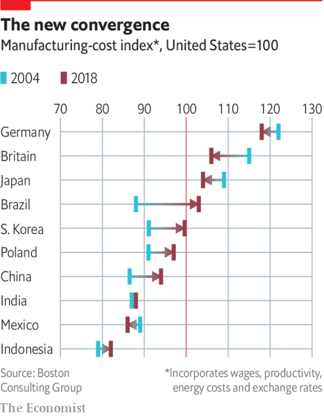

###### Global supply chains

# Supply chains are undergoing a dramatic transformation 

 

> print-edition iconPrint edition | Special report | Jul 13th 2019 

TOM LINTON, chief procurement and supply-chain officer at Flex, an American contract-manufacturing giant, has his finger on The Pulse. That is the name of his firm’s whizzy command centre in California, which is evocative of a Pentagon war room. The kit allows him to monitor Flex’s 16,000 suppliers and 100-plus factories, producing everything from automotive systems to cloud-computing kit for over 1,000 customers worldwide. Mr Linton is one of the acknowledged kings of the supply chain—the mechanism at the heart of globalisation of the past few decades by which raw materials, parts and components are exchanged across multiple national boundaries before being incorporated into finished goods. Ask him about the future, however, and he answers ominously: “We’re heading into a post-global world.” 

A few years ago that would have been a heretical thought. The combination of the information-technology revolution, which made communications affordable and reliable, and the entry of China into the world economy, which provided bountiful cheap labour, had transformed manufacturing into a global enterprise. In his book “The Great Convergence”, Richard Baldwin argues that the resulting blend of Western industrial know-how and Asian manufacturing muscle fuelled the hyper-globalisation of supply chains. From 1990 to 2010, trade boomed thanks to tariff cuts, cheaper communications and lower-cost transport. 

The OECD, a think-tank for advanced economies, reckons that 70% of global trade now involves global value chains (GVCs). The increase in their complexity is illustrated by the growth in the share of foreign value added to a country’s exports. This shot up from below 20% in 1990 to nearly 30% in 2011. 

Western retailers developed networks of inexpensive suppliers, especially in China, so that they in turn could deliver “everyday low prices” to consumers back home. Multinational corporations (MNCs) that once kept manufacturing close to home stretched supply chains thin as they chased cheap labour and economies of scale on the other side of the world. Assuming globalisation to be irreversible, firms embraced such practices as lean inventory management and just-in-time delivery that pursued efficiency and cost control while making little provision for risk. 

But now there are signs that the golden age of globalisation may be over, and the great convergence is giving way to a slow unravelling of those supply chains. Global trade growth has fallen from 5.5% in 2017 to 2.1% this year, by the OECD’s reckoning. Global regulatory harmonisation has given way to local approaches, such as Europe’s data-privacy laws. Cross-border investment dropped by a fifth last year. Soaring wages and environmental costs are leading to a decline in the “cheap China” sourcing model. 

The immediate threat comes from President Donald Trump’s imposition of tariffs on America’s trading partners and renegotiation of free-trade agreements, which have disrupted long-standing supply chains in North America and Asia. On June 29th, Mr Trump agreed a truce with Xi Jinping, China’s president, that temporarily suspends his threatened imposition of duties of up to 25% on $325bn-worth of Chinese imports, but leaves in place all previous tariffs imposed during the trade war. He threatened in May to impose tariffs on all imports from Mexico if it did not crack down on immigration, but reversed himself in June. He has delayed till November a decision on whether to impose tariffs on automobile imports, which would hit European manufacturers hard. 

Look beyond politics, though, and you will find that supply chains were already undergoing the most rapid change in decades in response to deeper trends in business, technology and society. The rise of Amazon, Alibaba and other e-commerce giants has persuaded consumers that they can have an endless variety of products delivered instantly. This is putting enormous pressure on MNCs to modify and modernise their supply chains to keep pace with advancing innovations and evolving consumer preferences. 

The biggest force for change is technology. Artificial intelligence (AI), predictive data analytics and robotics are already changing how factories, warehouses, distribution centres and delivery systems work. 3D printing, blockchain technologies and autonomous vehicles could have a big impact in future. Some even dream of autonomous supply chains requiring no human intervention. 

 

However, technological advances also raise the spectre of an arms race in supply-chain security. Aggressive private hackers and state-sponsored cyber-warriors appear to have the upper hand over beleaguered corporations and governments. Recent headlines have focused on America’s crackdown on Huawei, a Chinese telecoms giant. But the issues involved go far beyond one firm, given that much of the world’s electronics-manufacturing and hardware innovation takes place in China. 

If a technology cold war breaks out, it would smash today’s highly integrated technology supply chains and force an expensive realignment. It may even lead to a bifurcation in the rollout of 5G, a new telecoms-network technology that is the essential enabler of coming marvels such as the internet of things (IOT). With the proliferation of inexpensive sensors, the IOT will allow homes, factories and cities to be digitally monitored and managed. A “splinternet of things” (in which America followed one standard and China another) would not only be costly and inefficient, it would also fail to address legitimate security concerns about future cyber-threats in the age of 5G. 

Even if Huawei is eventually spared, and the truce in America’s trade war with China turns into a frosty peace, the era of frictionless supply lines flowing from Shenzhen to San Francisco and Stuttgart has ended. As globalisation is transformed into something messier, the consequences for MNCs and the world economy could be momentous. 

This report will show that supply chains were already becoming shorter, smarter and faster before politicians started taking a hammer to the trading system. Given today’s riskier world, supply chains will need to become safer too. This transformation threatens firms that have entrenched supply networks, but it also presents opportunities for those that adapt nimbly. 

