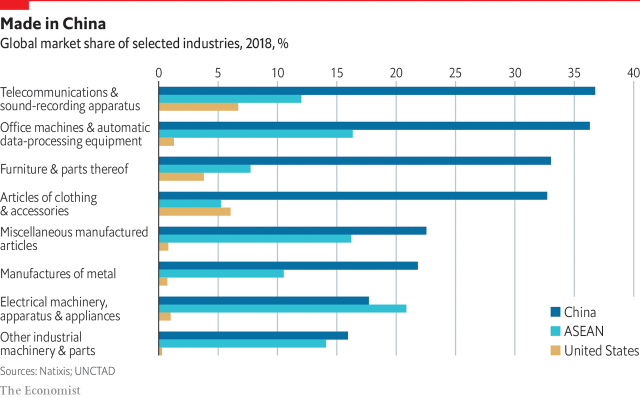

###### Three industries

# Supply chains for different industries are fragmenting in different ways 

 

> print-edition iconPrint edition | Special report | Jul 11th 2019 

GLOBALISATION IS BECOMING regionalisation. Analysis by MGI finds that the global value chains (GVCs) in 16 of 17 big industries it studied have been contracting since the global financial crisis. Trade continued to grow in absolute terms from 2007 to 2017, but during that period exports in those same value chains declined from 28.1% to 22.5% of gross output. The biggest declines in trade intensity were observed in the most heavily traded and complex GVCs, such as those in clothing, cars and electronics. As MGI’s Susan Lund explains, “more production is happening in proximity to major consumer markets”. 

China’s role as the world’s workshop is starting to fade, but surprisingly this may not sound the death knell for mainland manufacturing. Thanks to its skilled labour force and excellent infrastructure, China remains an outstanding place to make things, hence its continued strength in numerous sectors (see chart). Also, the rise of the Chinese middle class has led many firms to redirect production to serve the local market. So MNCs are clearly rethinking the old linear sourcing model for Western markets, but the path forward is unclear. Different industries will make different choices. 

Corporate supply-chain data are often opaque and official trade statistics typically lag by years. Yet talking to many firms in three industries reveals different patterns of fragmentation. The clothing sector is globally footloose; the car industry is coalescing around regional hubs; and the electronics business remains rooted in China (though Mr Trump’s attack on Huawei, its technology champion, will affect this). 

 

Big parts of the clothing and footwear business involve labour-intensive tasks such as stitching, so cost-conscious bosses are always chasing low-cost markets. Many long ago left the mainland, where wages have soared, for South-East Asia and Bangladesh. Nike and Adidas make more training shoes in Vietnam than China. 

Today’s hot spot is Ethiopia, which has attracted investment by Calvin Klein and H&M. With labour costs of just $26 a month, it might seem a dream destination for the frugal clothier. But a report released in May by the NYU Stern Centre for Business and Human Rights argues that these wages are too low to meet workers’ basic needs, which is fuelling unrest. Productivity levels are low and attrition high. Paul Walsh of Newtimes Group, a clothing supply-chain firm, observes: “We’ve run out of magic countries.” 

Clothing bosses are increasingly preoccupied with speed more than cost, says Suresh Dalai, a supply-chain expert based in Asia. “In speed, China still has the edge,” he says, pointing to its world-beating online retailers, “social-commerce” innovators and nimble manufacturers. He thinks that demanding local consumers force Chinese clothing factories to remain enterprising and flexible. In contrast, factory bosses elsewhere complain of unreliability and low productivity. 

Unlike those cut-rate competitors, say experts, Chinese factories have the specialised machinery and experienced operators that are needed to make seamless fabrics and other higher-value textiles. Pravin Rangachari of Haggar, a leading manufacturer of men’s trousers, has no plans to abandon China’s highly automated fabric mills, which he finds “very competitive”. He adds that compliance with child-labour laws is strong in China, which cannot always be said about other markets. 

China’s share in big clothes-importing markets such as Japan and Europe has declined since 2010 as they have been buying cheaper clothes made in South-East Asia instead. However, China’s share in every big textile-import market in Asia has soared because many of those workshops still bought fabrics from the mainland. Its export share into Vietnam, for example, more than doubled to 50% from 2005 to 2017. The upshot is that although China’s once-dominant role in this industry has diminished, it remains strong in important niches. 

As for the automobile industry, its supply chains have both local and global dimensions. “Except for the jack in the trunk, which everybody gets from China, we’ve had a distributed global supply chain for a long time,” says Hau Thai-Tang, Ford’s top supply-chain executive. He sees a trend towards greater regionalisation coming with three hub-and-spoke networks: Mexico as the low-cost spoke for America; eastern Europe and Morocco for western Europe; and South-East Asia and China for Asia. 

One reason for regionalisation is that the American market is diverging from global trends, argues Kristin Dziczek of America’s Centre for Automotive Research, an industry-research outfit. The Trump administration has rejected carbon regulation and rolled back Obama-era rules promoting more fuel-efficient vehicles. Americans are increasingly favouring pickup trucks and sports-utility vehicles, gas guzzlers eschewed by much of the rest of the world. This has big implications. Ford has decided to phase out saloons altogether in its home market, for example, while GM has left Europe and is consolidating its North American operations. 

Car firms have invested heavily to turn Mexico into an export base. The value of its automobile exports has more than doubled since 2010, approaching $50bn last year. The main reasons are not the nearly-defunct North American Free Trade Agreement or lower labour costs, but rather Mexico’s four dozen free-trade agreements with other countries which allow it to export to almost half the world’s market for new cars tariff-free. Carmakers have rejigged supply lines to take advantage. Mexico’s car exports to Germany have nearly 40% German components by value, while those crossing its northern border have over 70% American content. 

Mr Trump’s tariffs on China have pushed Big Auto’s supply chains to become even more regional. “We’re finally ready to leave China,” says a senior supply-chain executive at a global car maker. His firm is looking seriously at shifting its sourcing for the global market from China to India, but finds Indian vendors “unreliable”. It thought about dividing between India and Mexico, but saw that its supply base would lose economies of scale. The winner will be Mexico, he says. 

A longer-term force that could turn automotive supply chains upside down is electrification. The Edison Electric Institute, a think-tank, estimates that the share of electric vehicles (EVs) in new car sales in America will rise from 2% in 2018 to over 20% in 2030. That could reduce trade in parts dramatically, since EVs have many fewer moving parts than conventional cars. Ford calculates that a shift to electric would reduce the value added by branded car manufacturers from 30% to 10%. 

Dyson, a British engineering firm, is now designing and manufacturing its new EVs in Singapore to be close to China. This is not just because the mainland is the biggest market for such vehicles. It is also the beating heart of global electronics production. 

Half the world’s electronics-manufacturing capacity is based on the mainland. Its strengths go beyond sheer scale to diversity and sophistication of products. The pace of hardware innovation in China’s Pearl river delta is unmatched even in Silicon Valley. So, too, is its unique blend of scale and agility. This is why most of the world’s technology giants make their kit in China. 

Many firms are discovering that leaving China is not so easy 

Rising costs led some electronics firms to consider moving out a few years ago. Most notably, Samsung has built a huge smartphone-manufacturing complex in Vietnam. Now the political risks associated with sourcing from China, especially the Huawei crackdown, are causing others to consider leaving. GoPro, which makes rugged digital cameras, is shifting much of its production to Mexico. Stanley Black & Decker, a big toolmaker, is moving production of its Craftsman brand of tools back to America. Sweden’s Ericsson is scaling up American manufacturing in anticipation of a boom in 5G telecoms-equipment sales. 

Many firms are discovering that leaving China is not so easy. John Kern is the head of supply chains at America’s Cisco, a telecoms-equipment company. Because of the concerns of customers in America and India who want non-China sourcing, it has upgraded its Mexican operations. But it still has many global customers without such concerns. He says China is a big manufacturing base for Cisco and “will remain so for many years to come”. 

George Yeo of Kerry Logistics, which has lorries and men all over Asia, has noticed an uptick in clients investing in South-East Asia. Vietnam and Cambodia are the biggest beneficiaries, he reports. But labour productivity is a big problem across the region and infrastructure can be ropey. Much of the investment he sees is going into labour-intensive industries like textiles. In electronics, Mr Yeo thinks the exodus is limited to low-end kit. “Thanks to automation and high value-add, Shenzhen is still king.” 

Scrutiny of these three sectors suggests a messy path forward from globalisation. Making this challenge more acute, MNC bosses are now faced with a double threat. Not only must they make supply chains shorter, they must make them faster.  

