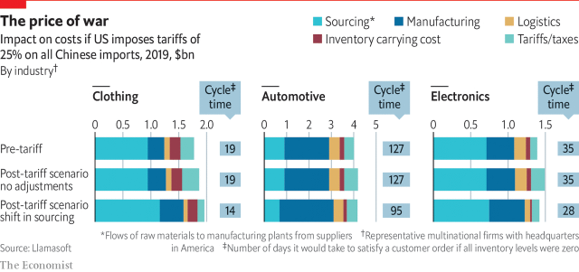

###### Trade war

# Which way out? 

 

> print-edition iconPrint edition | Special report | Jul 11th 2019 

LLAMASOFT, A SUPPLY-CHAIN analytics firm, looked at representative American MNCs in clothing, cars and electronics to assess the impact of America’s threatened imposition of a 25% tariff on all Chinese imports. It assumed firms would move sourcing and manufacturing out of China only as much as economic logic dictates. The analysis recognised the costs of moving production and the benefits of reduced inventories, cheaper logistics and shorter cycle times for inventory from positioning supplies closer to consumers. 

The clothing industry would see total costs jump by 11% after such tariffs. Sourcing costs would rise by 23% and manufacturing costs by 43%, but nearshoring would improve average cycle times from 19 to 14 days. Overall costs in the car industry would increase by less than 4%, but that would mask powerful counter-currents from the shift to regional hubs. Manufacturing costs would shoot up by 21%, but sourcing costs would drop by 25%. With cycle times falling from 127 days to 95, inventory and logistics costs would be cut. 

The electronics sector, which has strong roots in China, would see an increase in total costs of only 2%. Because making such kit outside the mainland is much pricier, even the modest amount of nearshoring assumed sends manufacturing costs shooting up by 28%. However, the reduction in cycle times from 35 days to 28 days would cut logistics costs and inventory costs dramatically. 

