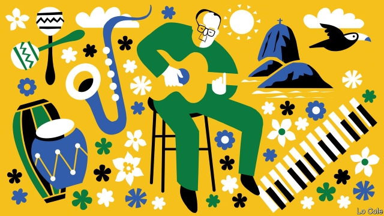

###### Bello

# João Gilberto, the man who sang “The Girl from Ipanema”, has died 

 

> print-edition iconPrint edition | The Americas | Jul 13th 2019 

IT WAS NOT João Gilberto’s fault, and as a perfectionist no doubt he suffered from it more than anyone, that his greatest hit, “The Girl from Ipanema”, has been mutilated into supermarket Muzak. At its height, in the late 1950s and early 1960s, the Brazilian fusion of samba, jazz, and other things too, known as bossa nova (“new style” in Portuguese) entranced the world. Back home, it formed the soundtrack to a period of cultural originality, from architecture to football, that seemed to augur a bright future for Brazil. As a guitarist and singer Mr Gilberto, who died an impoverished recluse on July 6th, aged 88, was a star of that moment. He lived to see a darker present. 

Born in the arid backlands of Brazil’s north-east, Mr Gilberto arrived in Rio de Janeiro in 1950 as a singer in one of the then-fashionable vocal ensembles. After his career stalled he retreated, broke and on the verge of mental illness, to a kind of internal exile. He spent months closeted with his guitar in a bedroom of a sister’s house, obsessively stripping down and rebuilding his way of playing it. He emerged with the terse, syncopated rhythm, complex chords and a gentle, almost spoken, singing style that were the marks of bossa nova. 

He returned to a Rio in musical ferment. A loose fellowship of bohemian young, mainly middle-class musicians, whose habitat was beachside apartments and the nightclubs of Copacabana, was striving to escape from traditional Brazilian folklore. Two stood out: Antônio Carlos (“Tom”) Jobim, a prodigiously talented pianist and composer (and fan of Debussy), and Vinicius de Moraes, a hard-drinking diplomat, poet and lyricist. In 1957 Mr Gilberto knocked on the door of Jobim’s house in Ipanema—and began to make history. 

It started with “Chega de Saudade” (“No More Blues”, in its American release), a short single which gave its title to an album that sold 500,000 copies in Brazil. Its controlled phrasing was seen as “a kick up the backside” to the era of romantic crooners, according to Ruy Castro, bossa nova’s chronicler. Jobim and de Moraes’s “The Girl from Ipanema”, a languid musing on the wistful contemplation of beauty by age, had its first performance, by Mr Gilberto, in a Rio nightclub in 1962. That was both zenith and swansong for bossa nova. The new music conquered the world, starting with a concert in Carnegie Hall in New York. Mr Gilberto made a hugely successful album with Stan Getz, an American saxophonist. But in Brazil bossa nova was yielding ground to protest music, rock ’n’ roll and a return to traditional samba. 

According to Caetano Veloso, a popular musician of a later generation, “bossa nova is a rare example of music that becomes popular by becoming more sophisticated.” It varied to samba in its harmonic complexity, as well as in the intimate introspection and sensuality of its lyrics. 

The bossa nova era was one of two great, creative ebullitions in 20th-century Brazil. The first came in the 1920s when a group of painters and writers embraced modernism under the banner of antropofagia (cultural cannibalism). Rather than merely imitating or rejecting foreign works of art, they consumed and then regurgitated them to create something both authentically Brazilian and universal. 

That approach came back in the late 1950s, when Brazil was enjoying a precarious period of democracy. Under Juscelino Kubitschek, a dashing social democrat, the country rushed not just to industrialise but to embrace the modern in general. As well as bossa nova, that impulse included the minimalist palaces of Oscar Niemeyer that adorned Brasília, the new capital; the concretist movement of poets and artists such as Mira Schendel and Lygia Clark; and, later, cinema novo, in which film directors adopted the techniques of Italian neorealists to address Brazil’s social divides. 

As Mr Veloso told the Guardian in 2013, “what was revolutionary about bossa nova is that a third-world country was creating high art on its own terms and selling that art around the world. It remains a dream of what an ideal civilisation can create.” 

The dream did not last long. A military coup in 1964 brought the curtain down on the bossa nova era. Now Brazil’s restored democracy is headed by Jair Bolsonaro, a socially conservative Pentecostalist who is openly nostalgic for military rule. In its sensitivity, disciplined search for perfection and openness to foreign influence, bossa nova was everything that Mr Bolsonaro’s vision of Brazil—vulgar, hate-filled and nationalistic—is not. Muzak rules. 

