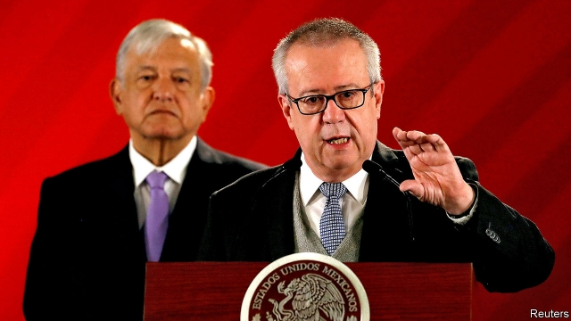

###### Resigning with rancour

# Mexico’s finance minister falls out with its populist president 

 

> print-edition iconPrint edition | The Americas | Jul 13th 2019 

IN MEXICO’S LEFTIST populist government, Carlos Urzúa, the social-democratic finance minister, was a reassuring figure. The president, Andrés Manuel López Obrador, has unorthodox ideas about how to develop Mexico. Mr Urzúa (pictured, right) would help make sure, investors hoped, that he pursued them without wrecking the economy. But on July 9th, after seven months in office, he quit, abruptly and noisily. In a venomous letter he said his ministry had been forced to employ unqualified people. “I am convinced that economic policy should be based on evidence” and free from “all extremism, whether of the right or the left”. This belief “found no echo” in the government, lamented Mr Urzúa. “I’ve never seen a letter like this in Mexico,” says Luis Rubio of CIDAC, a think-tank.  

Mr López Obrador (pictured, left), who took office in December, has lost other officials, including the environment secretary and the head of the migration institute. Some have left not because the president is spendthrift, but because he has slashed ministries’ budgets to make room for his pet projects. Cuts to health spending prompted the resignation in May of the head of the social-security institute. 

Mr Urzúa’s departure will hurt more. It dims the aura of a president who still has high approval ratings. It exposes infighting within his team. It will make economic management more difficult at a time when growth and investment are faltering. Most important, it raises the question whether Mr López Obrador’s coalition of radical activists new to government, defectors from the establishment and centre-leftists like Mr Urzúa can agree on a sensible governing programme. The markets are worried. The peso dropped by 1.5% after Mr Urzúa quit. 

In his parting letter he wrote that decisions “taken without sufficient basis” were among the factors that prompted him to leave. It is not clear what these were. Mr Urzúa took the job fully aware of Mr López Obrador’s most contentious proposals, such as building an oil refinery at a cost of $8bn (about 0.7% of GDP) or more and a “Maya train” (with a price tag of $6bn-8bn) in Mexico’s impoverished south. Mr Urzúa is thought to have opposed a government plan to force a renegotiation of gas-pipeline contracts with a Canadian firm that the previous government had signed. The plan damaged investors’ confidence in Mexico.  

The biggest source of tension was probably Pemex, the ailing state oil company. It is soon to present a plan for dealing with its $100bn debt. The finance minister draws up the company’s budget, so Mr Urzúa would have been involved. The president views oil as a foundation of Mexico’s greatness, insists the state should control it and opposes selling off money-losing parts of the company (see article). Rocío Nahle, the energy secretary, shares the president’s views. Mr Urzúa may have clashed with both of them. A plan that fails to reform Pemex would probably result in a downgrade of the firm’s credit rating to junk status, says Pablo Medina of Welligence, an energy consultancy. 

Mr Urzúa may also have been frustrated by the president’s deep cuts to salaries and benefits of civil servants. These prompted the exit of many of the officials who have run the finance ministry for decades. 

Mr López Obrador named the minister’s successor within an hour of his resignation. His choice of Arturo Herrera, a finance undersecretary, helped calm the markets’ nerves. Mr Herrera, who has worked at the World Bank and as finance secretary in Mexico City when Mr López Obrador was its mayor, is thought to be wonkish and to understand the importance of the financial markets. 

But Mr Herrera is likely to have the same problems that Mr Urzúa did. In March Mr López Obrador publicly overruled him after he said that the government would delay construction of the refinery and use the money to help Pemex. A test will come in September when he presents next year’s budget, which will have to balance Mr López Obrador’s spending priorities with the need to maintain public services and hold down the deficit at a time of fragile growth. The president gave no sign that he will take Mr Urzúa’s criticisms to heart. In a riposte to his letter Mr López Obrador said: “Sometimes people don’t understand that we cannot continue with the same strategies.” 

But in appointing Mr Herrera, the president has shown that he understands the dangers of alienating moderates in his coalition. If the new finance minister feels forced to quit, the mood among investors will shift from alarm to panic, causing the peso to fall and inflation and interest rates to rise. A rancorous resignation has shown Mr López Obrador how hard it is to reconcile his development dreams with economic reality. 

