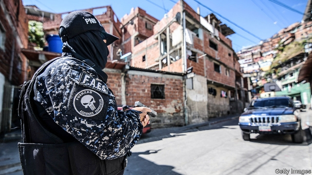
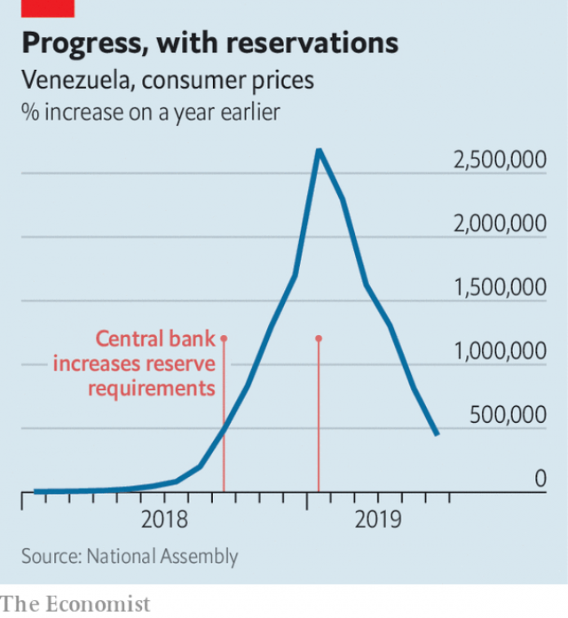

###### A bloody stalemate

# With tenacity and torture, Venezuela’s awful regime is hanging on 

 

> print-edition iconPrint edition | The Americas | Jul 13th 2019 

ALMOST SIX months since Juan Guaidó began his attempt to remove Venezuela’s leftist dictatorship, the strain is showing. The 35-year-old’s jet-black hair is peppered with grey. His eyes seem weary. He has dropped his snappy slogan, “vamos bien” (“we are doing well”). Now his demoralised supporters utter it sarcastically.  

But the need to end the rule of Nicolás Maduro is as strong as ever. His mismanagement, plus sanctions imposed in January on Venezuela’s oil industry by the United States, will cause the economy to shrink by more than 25% this year. In dollar terms, the drop in output since Mr Maduro became president in 2013 will be around 70%. Francisco Rodríguez, an economist in New York who has advised the moderate opposition, warns of famine. 

On July 5th the UN High Commissioner for Human Rights published evidence that security forces loyal to the government, such as the FAES, had murdered at least 6,800 people from January 2018 to May 2019. It documented cases of torture, including the use of electric shocks and waterboarding. The report, written by Michelle Bachelet, a left-wing former president of Chile who had once been sympathetic to Venezuela’s government, described health care as “dire” and noted “violations of the right” to food and other necessities. The regime called the report “biased”. Days before it was published, Rafael Acosta, a reserve naval captain accused of plotting to overthrow Mr Maduro, appeared in court in Caracas, bruised and unable to say anything but “help me” to his lawyer. He died hours later. 

Mr Guaidó, the head of the opposition-controlled legislature, had hoped to lead a velvet revolution. He assumed the interim presidency of Venezuela on January 23rd, on the grounds that Mr Maduro had rigged his re-election last year. The United States, all the big democracies in Latin America and most members of the European Union recognised Mr Guaidó as acting president. He and his supporters expected American oil sanctions to end the weakened regime. The army would switch sides, forcing its leaders into exile, where they would be consoled by a portion of the money they stole. A return to democracy would ensue. 

That plan has suffered one reversal after another. In February Mr Guaidó promised to bring in hundreds of tonnes of humanitarian aid, which had been stockpiled on Venezuela’s borders, “come what may”. Barely any got through. Last month it was distributed to Venezuelan migrants in Colombia. On April 30th the interim president appeared on a motorway in Caracas at dawn flanked by a few dozen rebel national guardsmen and by Venezuela’s best-known political prisoner, Leopoldo López, who had escaped house arrest that morning. The regime’s “final phase” was approaching, Mr Guaidó declared. But there was no military uprising. “I honestly think Maduro has won this,” says Yamila Pérez, an architect who took part in anti-government marches this year. 

Although Mr Maduro claims to “sleep like a child” (currently in the Fuerte Tiuna barracks in Caracas), he has cause for insomnia. The April uprising revealed splits in the regime. Cristopher Figuera, the chief of the intelligence service who defected, has said in recent interviews that the defence minister, Vladimir Padrino López, and the supreme court’s chief judge, Maikel Moreno, had plotted to oust Mr Maduro but lost their nerve. Both scoff at the claim. On July 7th Mr Maduro said that General Padrino López would stay in his job, perhaps wanting to keep his enemies close.  

The state-owned oil giant PDVSA, the main foreign-exchange earner, is trying to shift exports from the United States to Asia (see article). Corruption, mismanagement by executives chosen for their loyalty to the regime and now sanctions have caused output to plunge. Although Venezuela has the world’s largest proven oil reserves, much of the country is suffering from shortages of petrol. 

Remittances have replaced part of the lost oil money. Some 4m people, 12% of the population, have left Venezuela since the economic crisis became acute in 2014. Net remittances have risen from $200m in 2016 to $2bn in 2018. Another source of cash is gold, much of it mined by wildcatters with scant concern for the environmental damage they cause. These sidelines do not provide enough money to sustain imports. In 2018 non-oil imports were nearly 90% lower than in 2012. 

“The regime’s entire focus now is survival,” says a Caracas-based diplomat. “The rulebook has been thrown away.” Mr Maduro has quietly abandoned elements of the socialism brought in by his predecessor, Hugo Chávez. In January the government allowed the bolívar to float almost freely for the first time since 2003, closing the huge gap between the official exchange rates (there were two) and the black-market rate. That ended a bonanza for loyalists who got access to dollars at the overvalued rate. The state and firms it owns have defaulted on more than $11bn of principal and interest due on bonds. Mr Maduro still blames many of Venezuela’s woes on the “criminal dollar”, but recently the dollar has become accepted almost everywhere, from flea markets in Maracaibo to government-run five-star hotels in Caracas. 

 

 Inflation has plummeted, to a still stratospheric 445,482% (see chart). This is partly because hyperinflations always “run out of steam”, says Mr Rodríguez. The central bank also dampened inflation by forcing banks to raise reserves. But these moves towards saner economic policies have so far done little to ease hardship for most people. 

The main hope for a political transition, and it is a faint one, lies with talks between the opposition and government, which resumed in Barbados this week. It is hard to imagine a resolution to Venezuela’s agony that does not include Mr Maduro’s departure and a plan to hold elections with international monitoring. If that is to happen, the president will have to sleep less and worry more. 

