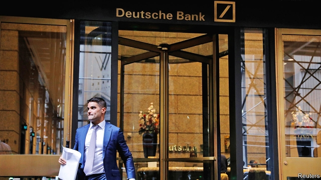
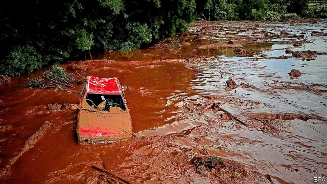

###### Riding high

# Business this week 

 

> Jul 13th 2019 

Deutsche Bank revealed details of a long-awaited €7.4bn ($8.3bn) restructuring plan. Its investment-banking division will bear the brunt. The troubled lender will close its global equity-trading unit and cut 18,000 people from its 91,500 workforce. It will also create a “bad bank” to house unwanted assets. Christian Sewing, Deutsche Bank’s chief executive, hopes the move will cut costs by €6bn a year. Analysts responded to the restructuring by saying it was long overdue. See article. 

Turkey’s President Recep Tayyip Erdogan sacked Murat Cetinkaya, the governor of the country’s central bank, and suggested that the institution needs an overhaul. Mr Cetinkaya was apparently ousted for refusing the president’s request to lower interest rates. Mr Erdogan seemingly wants greater control of monetary policy, a stance that has previously contributed to runs on the Turkish lira. See article. 

Britain’s Information Commissioner’s Office, a data-privacy regulator, said it would fine British Airways (BA) £183m ($230m) over a data breach last summer. In June 2018 criminals hacked into BA’s website and stole personal data, including the names, addresses and credit-card details of around 500,000 customers. It was the first fine Britain handed out under the EU’s new General Data Protection Regulation, which greatly increased the size of potential penalties. The second came the next day, when Marriott, a hotel group, was told it would be fined £99m for a data breach discovered last year. Both BA and Marriott said they would contest their penalties. 

Virgin Galactic said that it was planning an initial public offering. The firm, which hopes to take its first paying passengers into space early next year, could be valued at $1.5bn. Negotiations over a $1bn investment from Saudi Arabia’s sovereign-wealth fund were ended last year after the murder of Jamal Khashoggi, a journalist, by Saudi operatives in Istanbul. 

America began an investigation into France’s planned digital-services tax. The Trump administration says the 3% levy on the French revenues of big internet firms unfairly targets American companies like Google and Amazon. Its probe could result in America imposing tariffs or other trade restrictions. Several European countries are mulling digital taxes, though all say they would prefer a global deal—which the OECD, a club of rich countries, is trying to broker. 

The Trump administration said it would issue licences allowing American companies to sell their products to Huawei, a Chinese technology firm, provided that the sales do not threaten national security. In May, after trade talks with China collapsed, America had blacklisted the Chinese telecoms firm over security concerns related to its links to the Communist Party of China. President Trump agreed to allow Huawei to resume sales to American firms last month. 

America’s stockmarkets soared after Jerome Powell, the chairman of the Federal Reserve, hinted that the central bank is looking to cut interest rates this month. Investors piled into shares after Mr Powell cited concerns that the trade war with China and a global slowdown could hurt growth in America. The S&P 500 index of shares touched 3,000 for the first time. 

Mr Powell also warned that plans by Facebook to build a digital currency called Libra raise “serious concerns”. The central banker told America’s House of Representatives that Facebook should address fears about privacy, money laundering, consumer protection and financial stability before moving forward with the project. Several executives at the social network are scheduled to be questioned by Congress later this month. 

A profit warning from BASF, the world’s largest maker of chemicals, weighed heavily on the German stockmarket. The company slashed its forecast for full-year earnings by 30%. In response its share price slid by 5%. The company blamed a global economic slowdown, caused by the trade war between America and China, as well as a “particularly strong” downturn in car manufacturing, for the downgrade. 

 

A Brazilian judge ordered Vale, a mining giant, to pay full compensation for damage caused when one of its dams in the north of the country broke in January, killing at least 248 people. Vale must stump up for all the effects of the disaster, including the cost of the economic hit to the region. The judge said it was still not possible to calculate a final figure for the total amount Vale will have to pay. 

