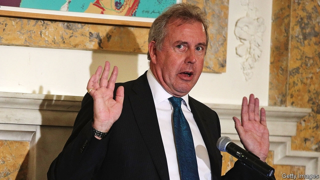
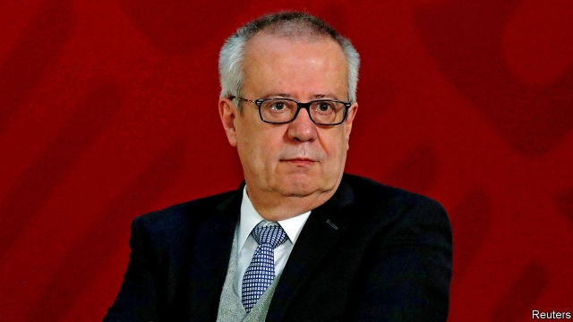

###### Riding high

# Politics this week 

 

> Jul 13th 2019 

Britain’s ambassador to America, Sir Kim Darroch, resigned after President Donald Trump said he would “no longer deal with him”. The spat came after Sir Kim’s confidential cables to London were leaked to a newspaper. They described the White House as “dysfunctional”, “clumsy” and “inept”, and its occupant as “radiat[ing] insecurity”. The British government backed its man, but Boris Johnson, the probable next prime minister, conspicuously did not. Sir Kim took the hint. See article. 

Mr Trump violated the American constitution by blocking those whose views he disliked from his Twitter account, a federal appeals court ruled. It said the First Amendment forbids a public official to operate in such a way on a platform used to conduct government business. The case was brought by the Knight First Amendment Institute at Columbia University on behalf of seven blocked Twitter users. See article. 

Carrie Lam, Hong Kong’s chief executive, declared that a controversial extradition bill was “dead”. Protesters were not satisfied. They have demanded the formal withdrawal of the bill, which would allow Hong Kongers suspected of crimes in mainland China to be sent there to stand trial. The bill was the initial spark for weeks of massive demonstrations, which now appear certain to continue. 

The ambassadors of 22 countries on the UN Human Rights Council have signed a letter criticising China’s mass internment of Uighurs in camps. Experts believe more than 1m Uighurs—a mostly Muslim ethnic minority in China—have been locked up as part of a campaign to make the region less restive. The letter does not have the force of a resolution, but it represents a rare concerted effort at the UN to lobby China over the camps. 

Japan accused South Korea of failing to enforce international sanctions against North Korea fully. The complaint was the latest barb in an escalating row between the two countries, after Japan imposed restrictions on exports to South Korea in protest at judgments against Japanese firms in South Korean courts. 

At least 20 people were killed in tribal violence in a remote area in the highlands of Papua New Guinea. Pregnant women and children were among the victims. 

 

Kyriakos Mitsotakis, leader of Greece’s centre-right New Democracy party, won an overall majority at a general election, thanks to a 50-seat top-up that is given to the party that wins the most seats. He has promised tax cuts and a more business-friendly environment. Greece still grapples with serious economic problems that the outgoing left-wing Syriza government, led by Alexis Tsipras, has failed to resolve. See article. 

A tape surfaced that purports to be of a conversation between a former close aide to Matteo Salvini, the powerful deputy prime minister of Italy, and a number of Russians concerning ways of secretly using Russian money to fund Mr Salvini’s Northern League party. He denied ever receiving “a rouble, a euro, a dollar or a litre of vodka”. See article. 

Germany’s chancellor, Angela Merkel, suffered what seemed to be a third public episode of uncontrollable shaking. She insists that her health is good. 

A Nigerian court ordered the seizure of $40m in jewellery from a former oil minister, Diezani Alison-Madueke. Muhammadu Buhari, who won a second term as Nigeria’s president earlier this year, campaigned on a promise to reduce corruption. 

The generals running Sudan since the fall in April of its dictator, Omar al-Bashir, reached a power-sharing accord with the pro-democracy movement that has been demanding an end to military rule. The deal makes provision for the generals to lead a new Supreme Council, which will be the highest decision-making body, for 21 months. Civilians will take over for a further 18 months before elections. See article. 

A deal signed in 2015 to prevent Iran from building a nuclear bomb came closer to collapse after its three European signatories (Britain, France and Germany) said they were concerned that Iran was “not meeting several of its commitments”. The accord offered Iran relief from some economic sanctions in exchange for limits on its nuclear programme. But President Trump withdrew America from the deal last year and reimposed sanctions. Iran has since breached caps on uranium enrichment. And tensions with the West rose after Britain seized a tanker carrying Iranian oil. See article. 

Negotiators for Taliban insurgents met representatives of the Afghan government to discuss a peace agreement for the first time, albeit unofficially. The talks were disguised as part of a bigger meeting of Afghan groups. America has held seven rounds of negotiations with the Taliban about a possible withdrawal from Afghanistan, but also wants the government and the insurgents to speak directly. See article. 

 

Mexico’s finance minister, Carlos Urzúa, resigned after claiming that the administration of President Andrés Manuel López Obrador had made his job impossible and had forced his ministry to hire unqualified people. Mr Urzúa, a social democrat, was a voice of prudence in the cabinet of the populist leftist president. The country’s currency, the peso, tumbled after the announcement (though it later recovered). See article. 

A UN report accused Venezuela’s security forces of killing almost 7,000 people between January 2018 and May this year. It singles out the country’s special forces for carrying out most of the killings and manipulating the crime scenes to suggest that the victims were shot for resisting arrest. It came out days after a reserve captain in the country’s navy died in custody, apparently after being tortured. See article. 

The lower house of Brazil’s congress approved a reform of the country’s unsustainably generous pension system by a vote of 379 to 131. The measure would save taxpayers 900bn reais ($240bn) over ten years. 

João Gilberto, the man who sang “The Girl from Ipanema”, died aged 88 in Rio de Janeiro. Mr Gilberto was a star of bossa nova, a musical style that fuses jazz and samba. See article. 

