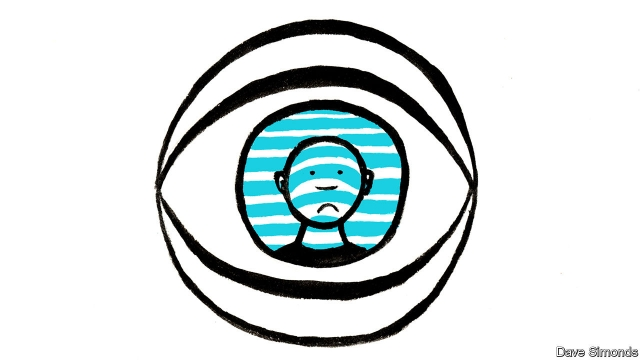

###### Surveillance technology

# America mulls regulating facial recognition 

 

> print-edition iconPrint edition | United States | Jul 13th 2019 

WHEN THINKING about police use of facial recognition, most Americans probably fall somewhere between two extremes. On one side is the approach taken by San Francisco and Somerville, Massachusetts, both of which earlier this year banned municipal agencies, including the police, from using facial recognition. 

On the other is the view expressed by Michael McCaul, a Republican congressman from Texas, who during a hearing of the House Homeland Security Committee on July 10th announced: “When somebody is in the public domain…there’s no expectation of privacy.” Imagine a world in which cameras equipped with facial recognition were ubiquitous. In Mr McCaul’s view, a permanent government record of everywhere everyone goes would be the price people pay for leaving their homes. 

The Supreme Court has rejected versions of that view in United States v Jones, a case in 2012 which held that police violated a suspect’s Fourth Amendment rights by attaching a GPS device to his car without a warrant. Carpenter v United States held that obtaining a suspect’s mobile-phone metadata without a warrant also violated his privacy rights. John Roberts, the chief justice, noted that the Court had long “recognised that individuals have a reasonable expectation of privacy in the whole of their physical movements”. A person may have attenuated expectations of privacy in public, but tracking everywhere they go violates them. 

Bennie Thompson, who chairs the House Homeland Security Committee, charted a reasonable path between those views in last week’s hearing. “Before the government deploys [facial recognition] further,” he said, “[it] must be scrutinised and the American public needs to be given a chance to weigh in.” His committee’s hearing, on how the Department of Homeland Security uses facial recognition and other biometrics, had been scheduled for some time, but news that broke on July 7th gave it extra salience. 

The Washington Post reported that over the past several years, federal agents have conducted almost 400,000 facial-recognition searches using state and local databases, including collections of drivers’-licence photos, without warrants or licence-holders’ consent. Among the searchers were agents from Immigration and Customs Enforcement (ICE), who appear to have trawled drivers’-licence photos in Utah, Vermont and Washington—all states that provide licences to undocumented immigrants. These states invited undocumented immigrants to come forward. The federal government then used that trust against them. 

In May the House Oversight Committee examined the civil-liberties implications of the technology. The committee chairman, Elijah Cummings, plans to hold another hearing before calling for legislation. Privacy may yet prove to be the rare issue on which an otherwise largely divided American public can agree.  

