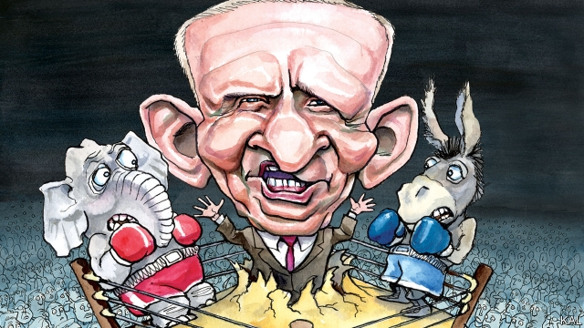

###### The outsider

# Remembering third-party presidential candidate Ross Perot 

 

> print-edition iconPrint edition | United States | Jul 13th 2019 

SANDWICHED BETWEEN Bill Clinton and George H.W. Bush on the presidential debate platform in 1992, Ross Perot looked like a grizzled man-child. At five feet five inches tall, he was almost a foot shorter than the thoroughbred Republican president and Democratic governor. He had to stand—while they slouched on their bar stools—to look them in the eye. A lesser man, running in a different year, might have appeared ridiculous. Yet the Texan billionaire, whose death this week recalls one of America’s strangest and most fateful political careers, thrived on the contrast. 

America was in the economic doldrums and, after 12 years of Republican rule, aching for a change that slick Mr Clinton was not quite trusted to deliver. This created an opportunity for an outsider that Mr Perot, pint-size, scrappy and quivering with contempt for both parties (as well as hostility towards the president—a Yankee interloper to his beloved state), seized with hyperactive brio. 

He had two major policy impulses, a phobia of debt, on which he blamed most of America’s economic troubles, and an embrace of protectionism. “You implement that NAFTA”, he warned his opponents, “and you’re going to hear a giant sucking sound of jobs being pulled out of this country.” But his overarching message—the basis for the most successful third-party run in a century—was his vow to tear into Washington, DC, and shake things up. 

He was not the first to make that promise—indeed his pugnacity recalled two of the most successful third-party candidates before him, Theodore Roosevelt and George Wallace. Yet as the first billionaire populist candidate, Mr Perot had novel credentials and other advantages. At a time when the downturn and Bush’s spending had raised doubts about the Reaganite consensus, his epic success, as a pioneer of the computer-services industry, suggested he might actually know what to do about the economy. 

He was also able to cover his campaign costs; he spent $65m in 1992. He retained his eye for economies, though. He generated publicity by appearing on TV chat-shows—he announced his run on Larry King Live—where his folksy, sometimes perplexing, language (“Life is like a cobweb, not an organisation chart!”) and love of high jinks made him popular. In 1979 he launched a paramilitary operation to spring two employees from an Iranian jail. They were freed by a mob, not Mr Perot’s daredevilry, but that did not spoil the story—or the thriller by Ken Follett and subsequent TV miniseries. 

He was a genius salesman. And like many men who tell tales for a living, his grip on reality could be strained. He was a sucker for conspiracy theories—his belief that hundreds of American prisoners of war remained in Vietnamese jails was an enduring fantasy. His company headquarters resembled a prison camp, with barbed-wire fences, armed guards and strict dress and behavioural codes. Facial hair and short skirts were banned—but when an employee needed help with a sick child no expense was spared. He was a tycoon from another age, a paternalist with an eccentric edge; more Lord Leverhulme than Bill Gates. 

That blend of outlandish achievement and disruptive idiosyncrasy was central to his appeal. Americans wanted to get back to winning and, in the absence of fresh thinking from either party, were open to suggestions. After leading in early polling, Mr Perot eventually persuaded one in five to vote for him. That was despite his bizarre decision to call off his campaign for two months after the Democratic convention—because, he variously suggested, the security of his daughter’s wedding was threatened, or he had been blackmailed, or the Democrats had impressed him. 

The similarities with another paranoid billionaire populist are obvious. James Carville, Mr Clinton’s former strategist, called Mr Perot “John the Baptist” to the “disenchanted, displaced, non-college white voter”, to whom Donald Trump appeals. It really is hard to imagine the president without Mr Perot; his protectionist rhetoric is almost verbatim. Yet the comparison shows, too, how much has changed in American politics, mostly not for the better. It may also, more positively, suggest how worse can avoided. 

Mr Perot’s success, unlike Mr Trump’s, was based on appealing across the parties (a myth on the right that he cost Bush the election has been serially debunked). That reflected the many more independent voters who were then available; by contrast, the only way a charismatic independent could hope to win power in 2016 was by capturing one of the party’s nominations, as Mr Trump did. Mr Perot therefore pitched for votes in the centre. When not grandstanding on trade, he offered heterodox and mostly worthy ideas: he backed higher spending on education, abortion rights and modest gun control; as well deregulation and a strong defence. 

This made him influential in both parties. Before the advent of Mr Trump, his most enduring effect was to have pushed the Democrats—under Mr Clinton then Barack Obama—to embrace fiscal restraint. Indeed, it might not be obvious, given that the national debt has almost doubled as a share of output since 1992, but they overlearned that lesson. The Obama administration’s failure to apply a bigger stimulus in the depths of 2009 reflected its caution as well as Republican opposition. That should now serve as a warning to both parties as, in an effort to assuage the populist passions Mr Trump has aroused, they rush to embrace Mr Perot’s other, more damaging, big idea: protectionism. 

The anti-establishment tendency in American politics, its so-called “paranoid style”, which Mr Perot and Mr Trump represent, is rooted in subversive sentiment, not policy ideas. More spasmodic than linear, it has always been hard to manage, but mostly short-lived—as, with cooler heads in both parties the current outbreak could be. If only it could expire as graciously as Mr Perot. Asked in his last interview what he wanted to be remembered for, he said: “Aw, I don’t worry about that.” His political legacy is a mixed bag. Yet his record of good-humoured public service was great. 

