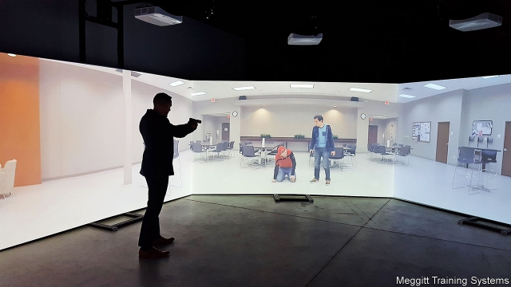

###### Know when to hold ’em

# Simulators teach police and their critics when to shoot 

 

> print-edition iconPrint edition | United States | Jul 11th 2019 

YOU ARE 23 years old, fresh out of the academy and eager to protect and serve, out on what was supposed to be a quiet weekday-afternoon patrol. You pass a red pickup truck, which your partner recognises: it belongs to a guy with a couple of outstanding arrest warrants. You pull him over. Your partner gets out of the car and tells the guy he has to bring him in. The guy promises to come in later this afternoon after he drops off his daughter, who is in the truck, at her mother’s house. Your partner refuses—he’s heard it before. The guy gets agitated. Suddenly the door of the truck opens, and a girl, maybe 10 or 11 years old, starts shouting at your partner for taking her daddy. She steps out of the truck, pointing her father’s hunting rifle at your partner. What do you do? 

That is just one of the roughly 500 scenarios on the FATS (Firearms Training Simulator), an interactive machine designed, says Raul Hernandez, a detective who puts nearly 1,000 Newark officers through their paces on the FATS twice a year, “to train our officers to survive an encounter with a person with a weapon.” Around 3,800 agencies in America, and hundreds more around the world, including the Canadian and Singaporean armies and the British Ministry of Defence, use these machines. 

The training is like a high-end video game. Holding a gun loaded with compressed air rather than bullets, trainees face a bank of screens as the scenarios unfold: a mentally ill man shouts threats while holding a weapon outside an apartment building, a teenaged girl menaces a boy with a knife, there is a live shooter in a hospital. Trainers can change the scenario as trainees respond. The weapon held by the mentally ill man might turn out to be a hairbrush. Sometimes the right response is a verbal one: the teenaged girl can put down the knife if ordered repeatedly and firmly to drop it. 

The machine teaches police when to pull the trigger and when to hold off. But it also shows citizens just how quickly police have to make life-and-death decisions. Mr Hernandez says that some activists and critics of the police have been put through their paces on the machines, and “come out saying, ‘I didn’t realise what a hard job you have’.” An officer from a different department noted wryly that citizens let loose on the simulator “shoot everybody”. Not quite: your correspondent, the father of an 11-year-old, got his partner killed because he could not shoot the girl with the rifle. 

