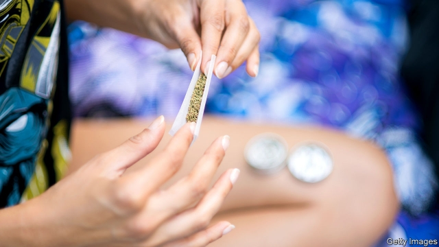

###### Unintended, uh, whatever, man

# The legalisation of recreational cannabis is weeding out teenaged users 

 

> print-edition iconPrint edition | United States | Jul 13th 2019 

WHEN JUSTIN TRUDEAU promised to legalise cannabis use across the border in Canada, his main reason for doing so was to protect the young. Cannabis is bad for the developing brain and a worrying number of minors were taking the drug. The counterintuitive proposal was based on the idea that regulated sales would drive out illegal sellers, who do not care how old their customers are. Legal sellers, however, will generally abide by age restrictions in sales to keep their licence. 

It is too early to tell whether Canada’s change, at the end of last year, will have the desired effect. Yet there is a wealth of historical data in America, which has been tinkering with various forms of liberalisation since the 1990s. Today 33 states permit medical cannabis, and 11 have legalised recreational use. The most recent legalisation bill, for recreational use, was signed in Illinois on June 25th. 

Until now the evidence on youth use was mixed. In Washington state one study found increased use among 8th and 10th graders after legalisation. A different study found that use among these groups actually fell. However, a new study, in the journal Jama Pediatrics, attempts a more comprehensive national analysis using data from biennial appraisals of high-school students known as the Youth Risk Behaviour Surveys. It found that relatively permissive laws were associated with a 9% decrease in frequent cannabis use by high-school students. There was no evidence that legalisation of cannabis for medical purposes encouraged use among young Americans. 

Although the drop is not large, it is notable given policy variation between states. Some states will have been more successful than others at chipping away at black-market sales, regulating licensed sellers and getting the message across that cannabis is damaging to young brains. Though the study showed only that a correlation between policy changes and a dip in teenaged use, a causal connection is plausible. 

Across the country cannabis remains a big, and flourishing, business worth nearly $10bn last year, and projected to rise to nearly $45bn by 2024. Yet California has become the first state to shrink its legal market after legalisation. Its value went from $3bn in 2017 to just $2.5bn last year, according to Arcview Market Research and BDS Analytics. 

The finding on teenaged use will put wind into the sails of advocates for liberalisation. Most of the public across many demographic groups supports legalising marijuana. At the same time, business growth is turning the pot industry into a force in the lobbies of Washington and of state capitols. Witness the Damascene conversion of John Boehner. The former House speaker, cannabis opponent and member of the Republican Party is now a board member and shareholder of New York-based cannabis firm Acreage Holdings. 

Earlier this year, Mr Boehner launched a new industry-funded lobbying group promoting “common-sense federal regulation”. Were federal law to shift to make cannabis legal, his firm Acreage could complete a lucrative sale to Canopy Growth, a big Canadian cannabis firm. On July 10th a Congressional committee held a hearing on “the need for reform”. With the promise of real jobs and investment that could come from federal legalisation, it could even become a vote-winner.  

