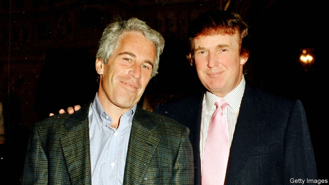

###### Acosted

# Was Jeffrey Epstein’s plea deal fishy? 

 

> print-edition iconPrint edition | United States | Jul 13th 2019 

THE INDICTMENT of Jeffrey Epstein on charges of sex-trafficking described a pyramid scheme for the sexual abuse of minors. Mr Epstein would pay hundreds of dollars apiece for sexual encounters with adolescent girls at his mansion in Manhattan’s Upper East Side and then pay them to recruit other underage girls. When police searched the residence they uncovered hundreds of pictures of nude, young-looking women—some on CDs kept in a locked safe with names like “Misc nudes 1” and “Girl pics nude”. Three personal employees apparently aided in the scheme. This is all revolting, but it is hardly a great surprise. 

More than a decade ago police and prosecutors stumbled across a similar pattern of conduct in Palm Beach, Florida, where Mr Epstein owns another mansion. In a later civil case, the victims alleged that hundreds of young girls had been abused. Yet Mr Epstein got off remarkably lightly. His plea deal, which was not first shown to the victims as required by federal law, included charges of “soliciting prostitution” from a girl as young as 14 (and thus well below the state age of consent). He received a sentence of 18 months, of which he served 13 months in the private wing of a county jail. Mr Epstein was released for six days out of the week to go to work. Harsher sentences are doled out for forging a check. 

The case has thus come to symbolise something larger, about unequal justice for those with the right connections, or who can afford an all-star defence team. Mr Epstein is routinely described as a billionaire. Forbes, which chronicles America’s nine-zeroed class, says he is not and points out that his money-management firm, registered in the Virgin Islands, produced no public records and no list of clients. The magazine has never included him in its list of the 400 richest Americans. What is true is that Mr Epstein had money for private jets, a private island and a handful of houses. He was also on first-name terms with two presidents, Bill Clinton (“Jeffrey is both a highly successful financier and a committed philanthropist,” he once said) and Donald Trump (“I’ve known Jeff for 15 years. Terrific guy. He’s a lot of fun to be with. It is even said that he likes beautiful women as much as I do, and many of them are on the younger side,” Mr Trump told a magazine almost two decades ago). Since he was charged in 2006 both men have distanced themselves from Mr Epstein. 

Wealth, child abuse and presidents are powerful ingredients for conspiracy theories. The truth may be more prosaic. Mr Epstein’s original defence team included Alan Dershowitz and Kenn Starr, two lawyers skilled in defending the indefensible. The evidence in the original case appears overwhelming. In an interview with the Miami Herald the lead detective recounted phone records, flight logs and instructions for delivering flowers to one of Mr Epstein’s young fixations—alongside her high-school report card. But the difficulties of securing convictions in cases of rape or sexual abuse are well known. 

Nor is it obvious that the top federal prosecutor who negotiated the deal, Alexander Acosta, had better options available. That may not save him. Mr Acosta is currently serving as Mr Trump’s labour secretary. Democrats would now like him ousted. Nancy Pelosi, the Democratic speaker of the House, and Chuck Schumer, the Senate’s minority leader, have called for his resignation. So too have many of those vying for the Democratic presidential nomination. Mr Trump so far has lent his support, saying he feels “very badly” for Mr Acosta and noting that “he’s been a great, really great secretary of labour”. When past cabinet secretaries have attracted negative headlines, Mr Trump has often started out strongly supportive and then soured as the withering critiques continued. 

Turbulence in the Trump administration is no new phenomenon. Much of it results from a lack of due diligence. Mr Acosta was not properly vetted until after he was nominated for the post—following the withdrawal of Mr Trump’s previous nominee, Andrew Puzder, amid allegations of domestic abuse and failure to pay taxes. Among the portfolios Mr Acosta now oversees are enforcement of child-labour and human-trafficking laws. 

